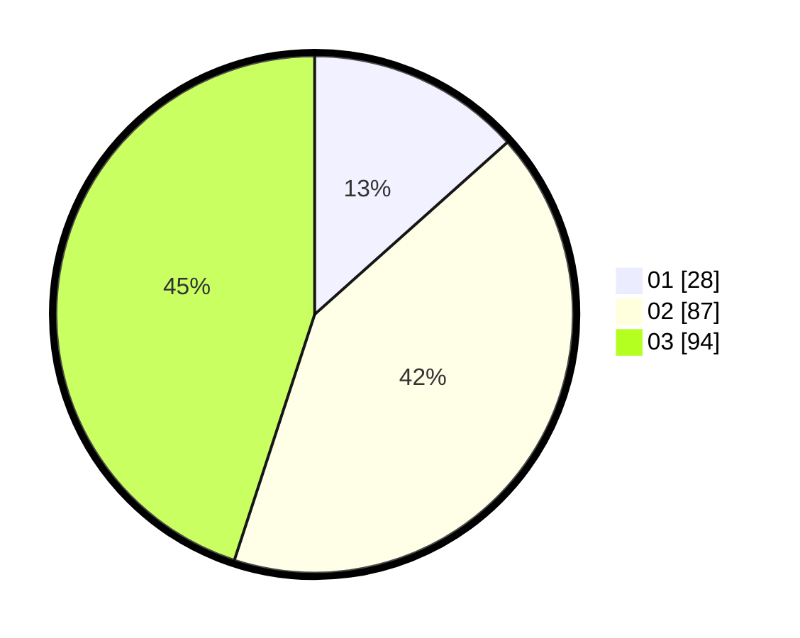

# Hasil

Hasil perolehan suara paslon dapat dilihat pada file paslon-01.txt, paslon-02.txt, dan paslon-03.txt.

Jika tidak ada, artinya data tersebut belum ada pada SIREKAP.

## Perolehan Suara

 * Paslon 01: **28**.
 * Paslon 02: **87**.
 * Paslon 03: **94**.

## Foto C Plano

https://sirekap-obj-formc.kpu.go.id/60c0/pemilu/ppwp/31/71/01/10/02/3171011002013-20240214-162225--1238dc35-2d41-49d1-bbaa-d2d34e5dc43c.jpg

https://sirekap-obj-formc.kpu.go.id/60c0/pemilu/ppwp/31/71/01/10/02/3171011002013-20240214-162230--59685928-d096-4e56-b5ea-839707d9ab55.jpg

https://sirekap-obj-formc.kpu.go.id/60c0/pemilu/ppwp/31/71/01/10/02/3171011002013-20240215-161717--c3436100-514a-4d65-a04e-b5608fb81a01.jpg
