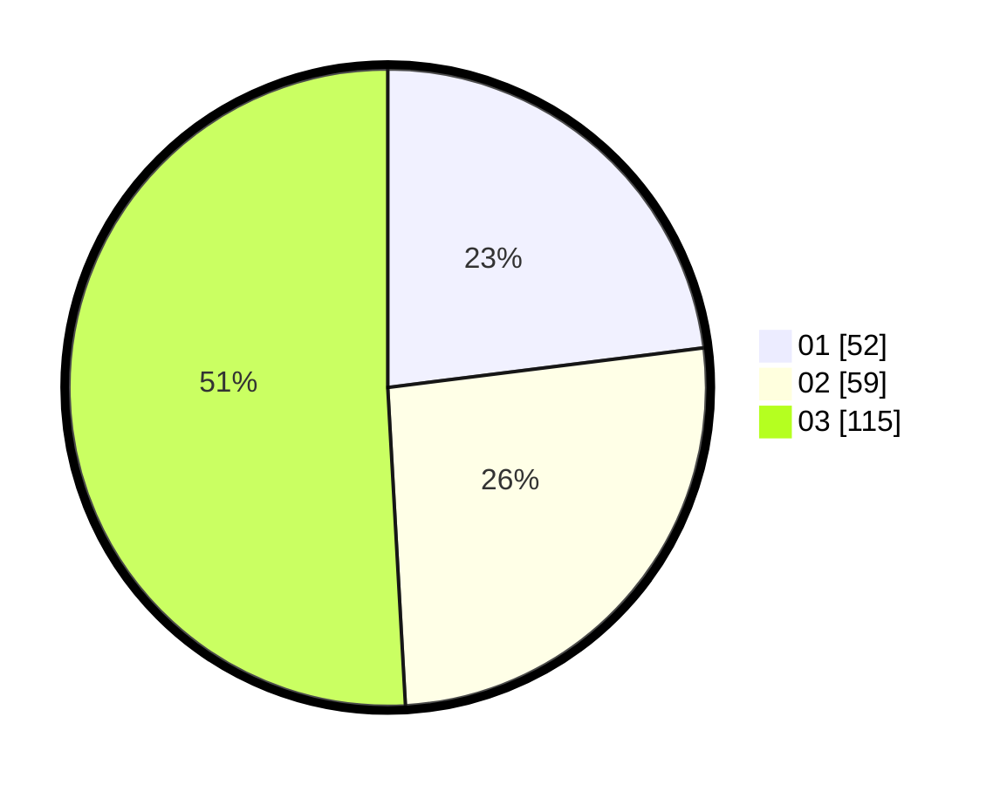

# Hasil

Hasil perolehan suara paslon dapat dilihat pada file paslon-01.txt, paslon-02.txt, dan paslon-03.txt.

Jika tidak ada, artinya data tersebut belum ada pada SIREKAP.

## Perolehan Suara

 * Paslon 01: **52**.
 * Paslon 02: **59**.
 * Paslon 03: **115**.

## Foto C Plano

https://sirekap-obj-formc.kpu.go.id/9254/pemilu/ppwp/31/71/01/10/02/3171011002014-20240214-202031--b635590f-dc6a-405b-8562-4019ede30e42.jpg

https://sirekap-obj-formc.kpu.go.id/9254/pemilu/ppwp/31/71/01/10/02/3171011002014-20240214-202218--223f472d-d34e-4472-8b67-97ac7e70d773.jpg
