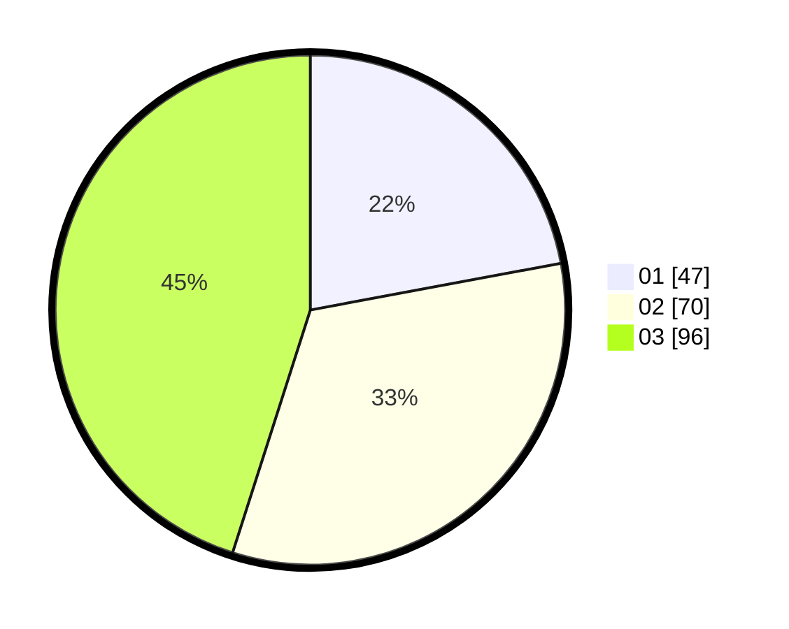

# Hasil

Hasil perolehan suara paslon dapat dilihat pada file paslon-01.txt, paslon-02.txt, dan paslon-03.txt.

Jika tidak ada, artinya data tersebut belum ada pada SIREKAP.

## Perolehan Suara

 * Paslon 01: **47**.
 * Paslon 02: **70**.
 * Paslon 03: **96**.

## Foto C Plano

https://sirekap-obj-formc.kpu.go.id/13dd/pemilu/ppwp/31/71/01/10/02/3171011002015-20240214-213409--2be49b35-8821-4136-a924-df177377c4d1.jpg

https://sirekap-obj-formc.kpu.go.id/13dd/pemilu/ppwp/31/71/01/10/02/3171011002015-20240215-002356--19a5b667-a032-4786-abb2-70bbbdb854e9.jpg

https://sirekap-obj-formc.kpu.go.id/13dd/pemilu/ppwp/31/71/01/10/02/3171011002015-20240215-002431--5853f9b8-5bfb-4188-b5fe-1dbe91d0fa0f.jpg

## DATA PEMILIH TETAP

Jumlah pemilih dalam DPT: **262**.
 * L: **104**.
 * P: **158**.

## DATA PENGGUNA HAK PILIH

Jumlah pengguna hak pilih dalam DPT: **203**.
 * L: **81**.
 * P: **122**.

Jumlah pengguna hak pilih dalam DPTb: **13**.
 * L: **5**.
 * P: **8**.

Jumlah pengguna hak pilih dalam DPK: **3**.
 * L: **1**.
 * P: **2**.

Jumlah pengguna hak pilih: **219**.
 * L: **87**.
 * P: **132**.

## JUMLAH SUARA SAH DAN TIDAK SAH

JUMLAH SELURUH SUARA SAH: **213**.

JUMLAH SUARA TIDAK SAH: **6**.

JUMLAH SELURUH SUARA SAH DAN SUARA TIDAK SAH: **219**.
