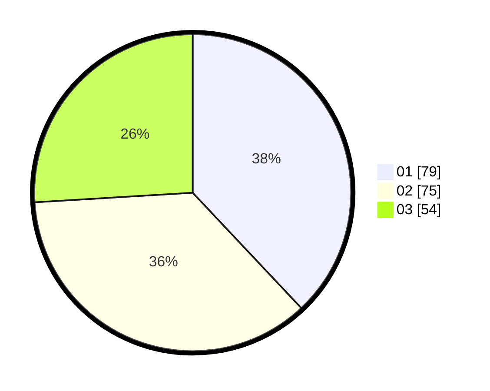

# Hasil

Hasil perolehan suara paslon dapat dilihat pada file paslon-01.txt, paslon-02.txt, dan paslon-03.txt.

Jika tidak ada, artinya data tersebut belum ada pada SIREKAP.

## Perolehan Suara

 * Paslon 01: **79**.
 * Paslon 02: **75**.
 * Paslon 03: **54**.

## Foto C Plano

https://sirekap-obj-formc.kpu.go.id/b896/pemilu/ppwp/31/71/01/10/02/3171011002016-20240217-222721--8b075b69-c4ed-41c2-9fd7-5b7655a68c82.jpg

https://sirekap-obj-formc.kpu.go.id/b896/pemilu/ppwp/31/71/01/10/02/3171011002016-20240217-222723--f013976d-5130-4dcc-a60f-782decfb6f98.jpg

https://sirekap-obj-formc.kpu.go.id/b896/pemilu/ppwp/31/71/01/10/02/3171011002016-20240217-222722--5fea5f56-081c-44f0-8055-34d14120c257.jpg

## DATA PEMILIH TETAP

Jumlah pemilih dalam DPT: **260**.
 * L: **125**.
 * P: **135**.

## DATA PENGGUNA HAK PILIH

Jumlah pengguna hak pilih dalam DPT: **206**.
 * L: **98**.
 * P: **108**.

Jumlah pengguna hak pilih dalam DPTb: **11**.
 * L: **1**.
 * P: **10**.

Jumlah pengguna hak pilih dalam DPK: **5**.
 * L: **5**.
 * P: **0**.

Jumlah pengguna hak pilih: **222**.
 * L: **104**.
 * P: **118**.

## JUMLAH SUARA SAH DAN TIDAK SAH

JUMLAH SELURUH SUARA SAH: **208**.

JUMLAH SUARA TIDAK SAH: **14**.

JUMLAH SELURUH SUARA SAH DAN SUARA TIDAK SAH: **222**.
