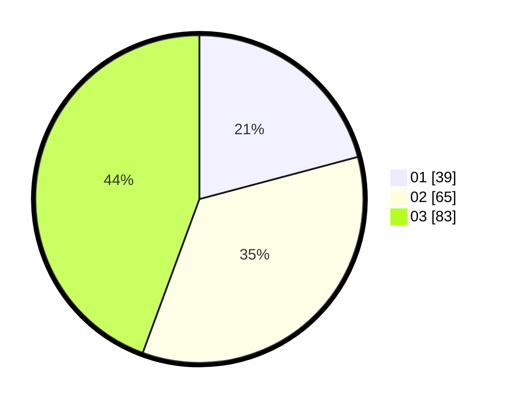

# Hasil

Hasil perolehan suara paslon dapat dilihat pada file paslon-01.txt, paslon-02.txt, dan paslon-03.txt.

Jika tidak ada, artinya data tersebut belum ada pada SIREKAP.

## Perolehan Suara

 * Paslon 01: **39**.
 * Paslon 02: **65**.
 * Paslon 03: **83**.

## Foto C Plano

https://sirekap-obj-formc.kpu.go.id/f156/pemilu/ppwp/31/71/01/10/02/3171011002017-20240214-175326--f66bcd76-a57e-4b76-899d-1d98e3cec4ea.jpg

https://sirekap-obj-formc.kpu.go.id/f156/pemilu/ppwp/31/71/01/10/02/3171011002017-20240214-180342--daad1bab-2e17-46fe-8d2e-0a6e3a2afdbb.jpg

https://sirekap-obj-formc.kpu.go.id/f156/pemilu/ppwp/31/71/01/10/02/3171011002017-20240215-214442--442a73c5-2a98-4ada-92d0-98421668903e.jpg

## DATA PEMILIH TETAP

Jumlah pemilih dalam DPT: **223**.
 * L: **97**.
 * P: **126**.

## DATA PENGGUNA HAK PILIH

Jumlah pengguna hak pilih dalam DPT: **177**.
 * L: **77**.
 * P: **100**.

Jumlah pengguna hak pilih dalam DPTb: **13**.
 * L: **1**.
 * P: **12**.

Jumlah pengguna hak pilih dalam DPK: **1**.
 * L: **0**.
 * P: **1**.

Jumlah pengguna hak pilih: **191**.
 * L: **78**.
 * P: **113**.

## JUMLAH SUARA SAH DAN TIDAK SAH

JUMLAH SELURUH SUARA SAH: **187**.

JUMLAH SUARA TIDAK SAH: **4**.

JUMLAH SELURUH SUARA SAH DAN SUARA TIDAK SAH: **191**.
