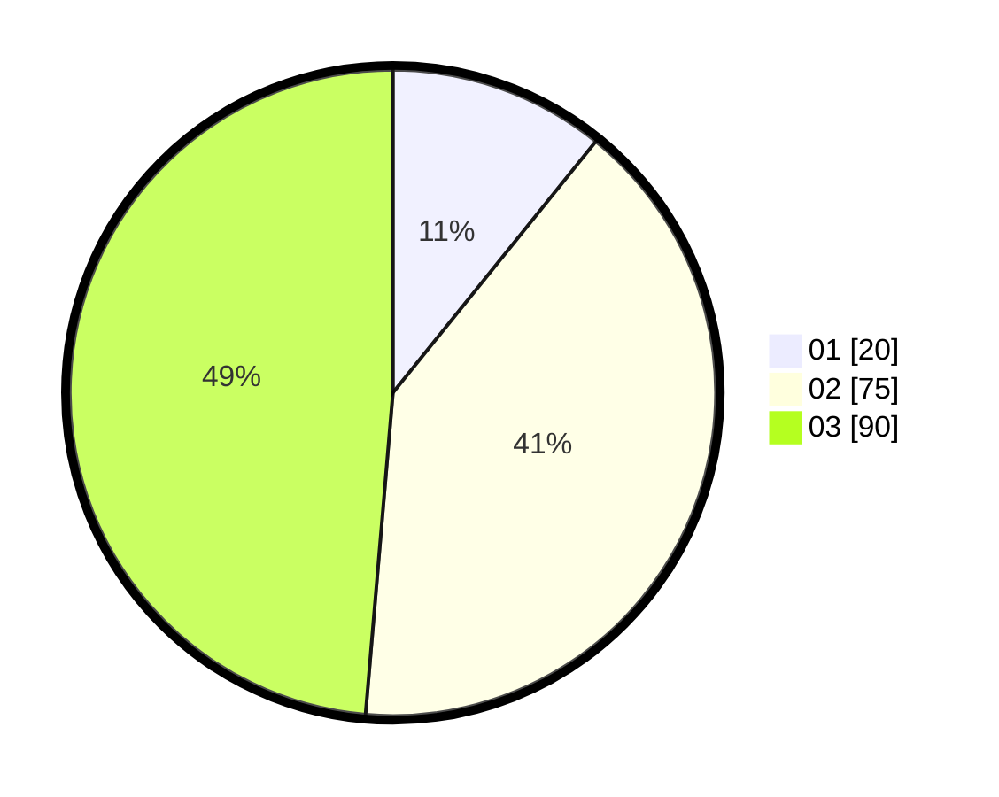

# Hasil

Hasil perolehan suara paslon dapat dilihat pada file paslon-01.txt, paslon-02.txt, dan paslon-03.txt.

Jika tidak ada, artinya data tersebut belum ada pada SIREKAP.

## Perolehan Suara

 * Paslon 01: **20**.
 * Paslon 02: **75**.
 * Paslon 03: **90**.

## Foto C Plano

https://sirekap-obj-formc.kpu.go.id/28f6/pemilu/ppwp/31/71/01/10/02/3171011002020-20240214-200157--da8790aa-11a7-4a9a-88cb-b1047bcda70a.jpg

https://sirekap-obj-formc.kpu.go.id/28f6/pemilu/ppwp/31/71/01/10/02/3171011002020-20240214-200233--2a9c77a1-c2bb-4bcf-aa68-25fcaa11162b.jpg

https://sirekap-obj-formc.kpu.go.id/28f6/pemilu/ppwp/31/71/01/10/02/3171011002020-20240214-200238--50159495-5a09-4635-8a65-ed00c57e5088.jpg

## DATA PEMILIH TETAP

Jumlah pemilih dalam DPT: **259**.
 * L: **123**.
 * P: **136**.

## DATA PENGGUNA HAK PILIH

Jumlah pengguna hak pilih dalam DPT: **177**.
 * L: **87**.
 * P: **90**.

Jumlah pengguna hak pilih dalam DPTb: **10**.
 * L: **3**.
 * P: **7**.

Jumlah pengguna hak pilih dalam DPK: **1**.
 * L: **0**.
 * P: **1**.

Jumlah pengguna hak pilih: **188**.
 * L: **90**.
 * P: **98**.

## JUMLAH SUARA SAH DAN TIDAK SAH

JUMLAH SELURUH SUARA SAH: **185**.

JUMLAH SUARA TIDAK SAH: **3**.

JUMLAH SELURUH SUARA SAH DAN SUARA TIDAK SAH: **188**.
