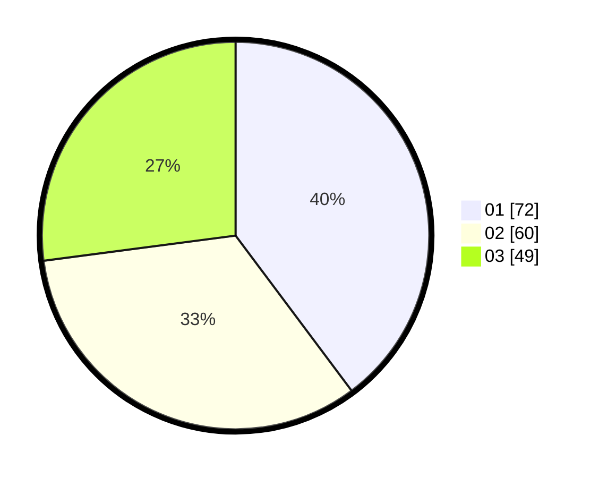

# Hasil

Hasil perolehan suara paslon dapat dilihat pada file paslon-01.txt, paslon-02.txt, dan paslon-03.txt.

Jika tidak ada, artinya data tersebut belum ada pada SIREKAP.

## Perolehan Suara

 * Paslon 01: **72**.
 * Paslon 02: **60**.
 * Paslon 03: **49**.

## Foto C Plano

https://sirekap-obj-formc.kpu.go.id/a2f4/pemilu/ppwp/31/71/01/10/02/3171011002021-20240215-235340--278bb568-93f5-45f7-94db-48292faeeb66.jpg

https://sirekap-obj-formc.kpu.go.id/a2f4/pemilu/ppwp/31/71/01/10/02/3171011002021-20240215-235343--175fe001-c71b-491c-a251-748f018e0366.jpg

https://sirekap-obj-formc.kpu.go.id/a2f4/pemilu/ppwp/31/71/01/10/02/3171011002021-20240215-235342--8cd82de2-713a-4709-8d41-6ff487565fe4.jpg

## DATA PEMILIH TETAP

Jumlah pemilih dalam DPT: **247**.
 * L: **121**.
 * P: **126**.

## DATA PENGGUNA HAK PILIH

Jumlah pengguna hak pilih dalam DPT: **164**.
 * L: **80**.
 * P: **84**.

Jumlah pengguna hak pilih dalam DPTb: **11**.
 * L: **1**.
 * P: **10**.

Jumlah pengguna hak pilih dalam DPK: **7**.
 * L: **4**.
 * P: **3**.

Jumlah pengguna hak pilih: **182**.
 * L: **85**.
 * P: **97**.

## JUMLAH SUARA SAH DAN TIDAK SAH

JUMLAH SELURUH SUARA SAH: **181**.

JUMLAH SUARA TIDAK SAH: **1**.

JUMLAH SELURUH SUARA SAH DAN SUARA TIDAK SAH: **182**.
