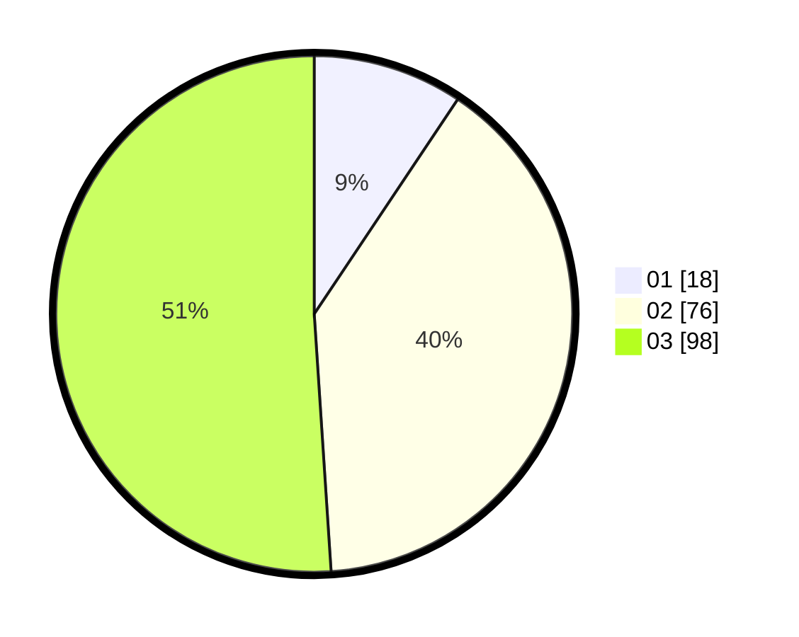

# Hasil

Hasil perolehan suara paslon dapat dilihat pada file paslon-01.txt, paslon-02.txt, dan paslon-03.txt.

Jika tidak ada, artinya data tersebut belum ada pada SIREKAP.

## Perolehan Suara

 * Paslon 01: **18**.
 * Paslon 02: **76**.
 * Paslon 03: **98**.

## Foto C Plano

https://sirekap-obj-formc.kpu.go.id/b3a3/pemilu/ppwp/31/71/01/10/02/3171011002022-20240215-163308--30dfb099-79da-4703-8086-69634c108b13.jpg

https://sirekap-obj-formc.kpu.go.id/b3a3/pemilu/ppwp/31/71/01/10/02/3171011002022-20240215-163333--975978e0-e322-46ff-bae4-86903e779114.jpg

https://sirekap-obj-formc.kpu.go.id/b3a3/pemilu/ppwp/31/71/01/10/02/3171011002022-20240215-163321--99f3a770-74db-4626-bcfa-b4513443abc2.jpg

## DATA PEMILIH TETAP

Jumlah pemilih dalam DPT: **196**.
 * L: **96**.
 * P: **100**.

## DATA PENGGUNA HAK PILIH

Jumlah pengguna hak pilih dalam DPT: **183**.
 * L: **91**.
 * P: **92**.

Jumlah pengguna hak pilih dalam DPTb: **10**.
 * L: **4**.
 * P: **6**.

Jumlah pengguna hak pilih dalam DPK: **3**.
 * L: **1**.
 * P: **2**.

Jumlah pengguna hak pilih: **196**.
 * L: **96**.
 * P: **100**.

## JUMLAH SUARA SAH DAN TIDAK SAH

JUMLAH SELURUH SUARA SAH: **192**.

JUMLAH SUARA TIDAK SAH: **4**.

JUMLAH SELURUH SUARA SAH DAN SUARA TIDAK SAH: **196**.
