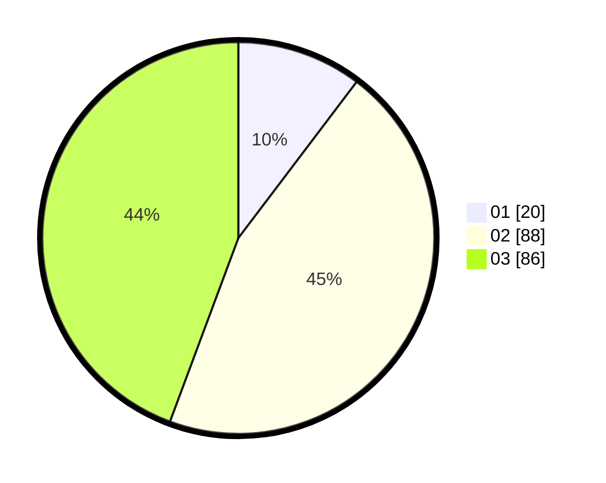

# Hasil

Hasil perolehan suara paslon dapat dilihat pada file paslon-01.txt, paslon-02.txt, dan paslon-03.txt.

Jika tidak ada, artinya data tersebut belum ada pada SIREKAP.

## Perolehan Suara

 * Paslon 01: **20**.
 * Paslon 02: **88**.
 * Paslon 03: **86**.

## Foto C Plano

https://sirekap-obj-formc.kpu.go.id/b4ec/pemilu/ppwp/31/71/01/10/02/3171011002023-20240216-210649--e5649380-f132-4040-912b-a444ed0d7a17.jpg

https://sirekap-obj-formc.kpu.go.id/b4ec/pemilu/ppwp/31/71/01/10/02/3171011002023-20240216-210650--2bbfb67b-8ad3-4607-ac60-b5fce55cdab0.jpg

https://sirekap-obj-formc.kpu.go.id/b4ec/pemilu/ppwp/31/71/01/10/02/3171011002023-20240216-210650--c23299b2-78c8-455c-9f3d-070b51d7047f.jpg

## DATA PEMILIH TETAP

Jumlah pemilih dalam DPT: **267**.
 * L: **117**.
 * P: **50**.

## DATA PENGGUNA HAK PILIH

Jumlah pengguna hak pilih dalam DPT: **197**.
 * L: **83**.
 * P: **114**.

Jumlah pengguna hak pilih dalam DPTb: **1**.
 * L: **0**.
 * P: **1**.

Jumlah pengguna hak pilih dalam DPK: **0**.
 * L: **0**.
 * P: **0**.

Jumlah pengguna hak pilih: **198**.
 * L: **83**.
 * P: **115**.

## JUMLAH SUARA SAH DAN TIDAK SAH

JUMLAH SELURUH SUARA SAH: **194**.

JUMLAH SUARA TIDAK SAH: **4**.

JUMLAH SELURUH SUARA SAH DAN SUARA TIDAK SAH: **198**.
