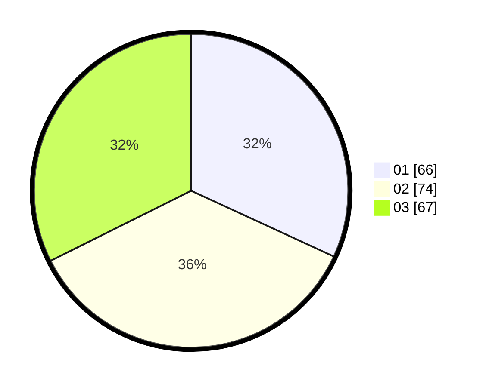

# Hasil

Hasil perolehan suara paslon dapat dilihat pada file paslon-01.txt, paslon-02.txt, dan paslon-03.txt.

Jika tidak ada, artinya data tersebut belum ada pada SIREKAP.

## Perolehan Suara

 * Paslon 01: **66**.
 * Paslon 02: **74**.
 * Paslon 03: **67**.

## Foto C Plano

https://sirekap-obj-formc.kpu.go.id/4bef/pemilu/ppwp/31/71/01/10/02/3171011002025-20240217-184510--51f824a6-6965-4689-af3d-6e249dc9348e.jpg

https://sirekap-obj-formc.kpu.go.id/4bef/pemilu/ppwp/31/71/01/10/02/3171011002025-20240217-184521--b6c3a7e0-9498-4a22-b3d4-2922848725f3.jpg

https://sirekap-obj-formc.kpu.go.id/4bef/pemilu/ppwp/31/71/01/10/02/3171011002025-20240217-184527--b3421e94-61db-4ca6-9ea7-f7ee5c775439.jpg

## DATA PEMILIH TETAP

Jumlah pemilih dalam DPT: **253**.
 * L: **118**.
 * P: **135**.

## DATA PENGGUNA HAK PILIH

Jumlah pengguna hak pilih dalam DPT: **202**.
 * L: **92**.
 * P: **110**.

Jumlah pengguna hak pilih dalam DPTb: **4**.
 * L: **3**.
 * P: **1**.

Jumlah pengguna hak pilih dalam DPK: **5**.
 * L: **2**.
 * P: **3**.

Jumlah pengguna hak pilih: **211**.
 * L: **97**.
 * P: **114**.

## JUMLAH SUARA SAH DAN TIDAK SAH

JUMLAH SELURUH SUARA SAH: **207**.

JUMLAH SUARA TIDAK SAH: **4**.

JUMLAH SELURUH SUARA SAH DAN SUARA TIDAK SAH: **211**.
