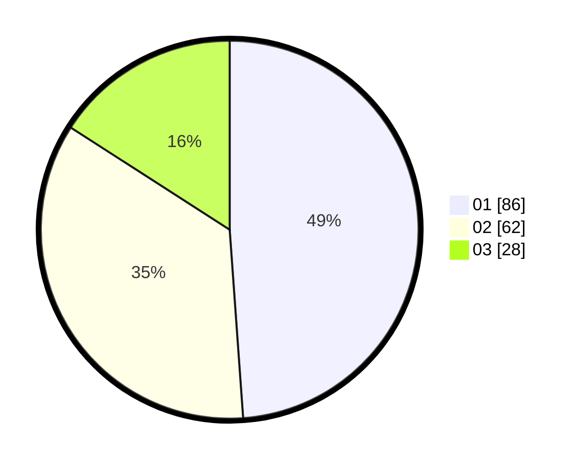

# Hasil

Hasil perolehan suara paslon dapat dilihat pada file paslon-01.txt, paslon-02.txt, dan paslon-03.txt.

Jika tidak ada, artinya data tersebut belum ada pada SIREKAP.

## Perolehan Suara

 * Paslon 01: **86**.
 * Paslon 02: **62**.
 * Paslon 03: **28**.

## Foto C Plano

https://sirekap-obj-formc.kpu.go.id/783b/pemilu/ppwp/31/71/01/10/02/3171011002027-20240216-144755--dd38e036-c577-43f4-a02c-f22243499420.jpg

https://sirekap-obj-formc.kpu.go.id/783b/pemilu/ppwp/31/71/01/10/02/3171011002027-20240216-144756--ad822545-1504-4913-833d-606d6e763003.jpg

https://sirekap-obj-formc.kpu.go.id/783b/pemilu/ppwp/31/71/01/10/02/3171011002027-20240216-144756--79bb44e1-cbd5-45bd-ae03-e3a17f5be2fa.jpg

## DATA PEMILIH TETAP

Jumlah pemilih dalam DPT: **252**.
 * L: **124**.
 * P: **128**.

## DATA PENGGUNA HAK PILIH

Jumlah pengguna hak pilih dalam DPT: **171**.
 * L: **80**.
 * P: **91**.

Jumlah pengguna hak pilih dalam DPTb: **4**.
 * L: **1**.
 * P: **3**.

Jumlah pengguna hak pilih dalam DPK: **2**.
 * L: **2**.
 * P: **0**.

Jumlah pengguna hak pilih: **177**.
 * L: **83**.
 * P: **94**.

## JUMLAH SUARA SAH DAN TIDAK SAH

JUMLAH SELURUH SUARA SAH: **176**.

JUMLAH SUARA TIDAK SAH: **1**.

JUMLAH SELURUH SUARA SAH DAN SUARA TIDAK SAH: **177**.
