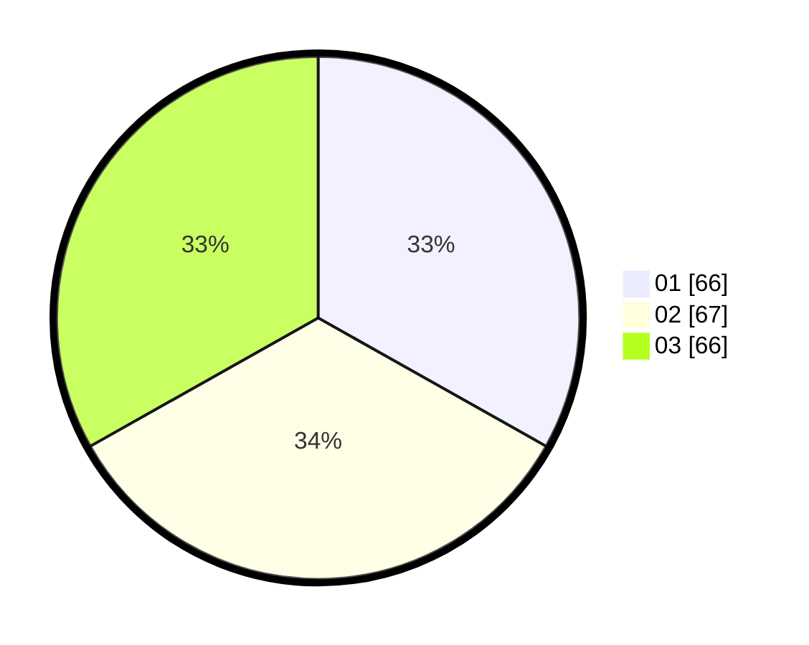

# Hasil

Hasil perolehan suara paslon dapat dilihat pada file paslon-01.txt, paslon-02.txt, dan paslon-03.txt.

Jika tidak ada, artinya data tersebut belum ada pada SIREKAP.

## Perolehan Suara

 * Paslon 01: **66**.
 * Paslon 02: **67**.
 * Paslon 03: **66**.

## Foto C Plano

https://sirekap-obj-formc.kpu.go.id/5527/pemilu/ppwp/31/71/01/10/02/3171011002030-20240216-071610--b61377ca-10f9-4b88-98de-b04e3d2169fe.jpg

https://sirekap-obj-formc.kpu.go.id/5527/pemilu/ppwp/31/71/01/10/02/3171011002030-20240216-071620--ebbd7367-3aef-4876-9f0a-7f9df356a06e.jpg

https://sirekap-obj-formc.kpu.go.id/5527/pemilu/ppwp/31/71/01/10/02/3171011002030-20240216-071616--28430668-396d-4c8e-8095-21707eb556d9.jpg

## DATA PEMILIH TETAP

Jumlah pemilih dalam DPT: **258**.
 * L: **128**.
 * P: **130**.

## DATA PENGGUNA HAK PILIH

Jumlah pengguna hak pilih dalam DPT: **186**.
 * L: **90**.
 * P: **96**.

Jumlah pengguna hak pilih dalam DPTb: **8**.
 * L: **2**.
 * P: **6**.

Jumlah pengguna hak pilih dalam DPK: **9**.
 * L: **5**.
 * P: **4**.

Jumlah pengguna hak pilih: **203**.
 * L: **97**.
 * P: **106**.

## JUMLAH SUARA SAH DAN TIDAK SAH

JUMLAH SELURUH SUARA SAH: **199**.

JUMLAH SUARA TIDAK SAH: **4**.

JUMLAH SELURUH SUARA SAH DAN SUARA TIDAK SAH: **203**.
