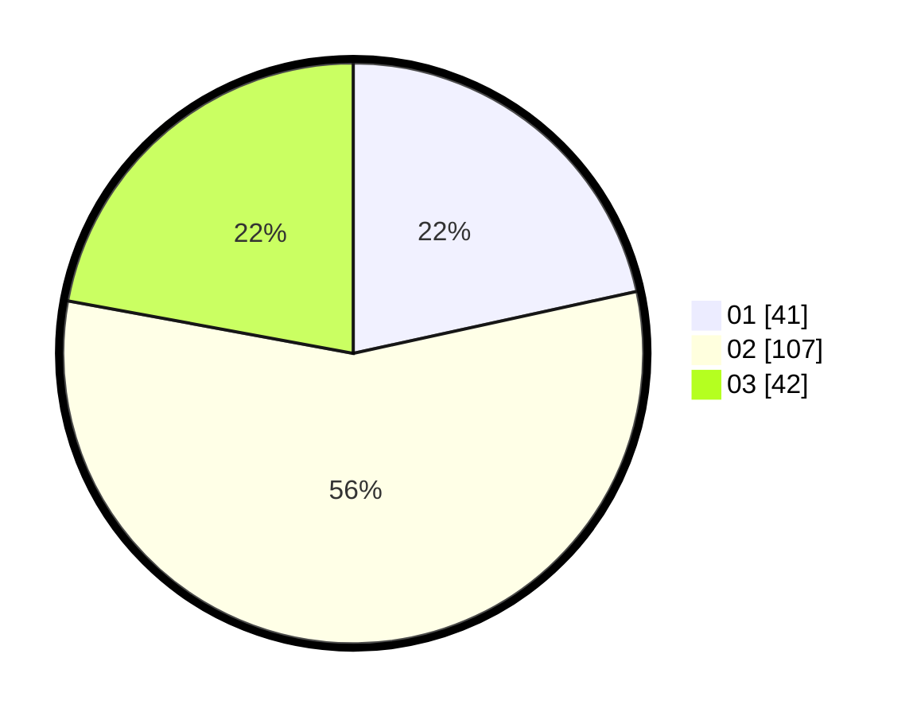

# Hasil

Hasil perolehan suara paslon dapat dilihat pada file paslon-01.txt, paslon-02.txt, dan paslon-03.txt.

Jika tidak ada, artinya data tersebut belum ada pada SIREKAP.

## Perolehan Suara

 * Paslon 01: **41**.
 * Paslon 02: **107**.
 * Paslon 03: **42**.

## Foto C Plano

https://sirekap-obj-formc.kpu.go.id/2991/pemilu/ppwp/31/71/01/10/02/3171011002031-20240216-132737--35a6788b-f808-41b1-b46a-f58dc2b51c80.jpg

https://sirekap-obj-formc.kpu.go.id/2991/pemilu/ppwp/31/71/01/10/02/3171011002031-20240216-132738--d21f2f74-b18f-427f-84de-cd323bc59e43.jpg

https://sirekap-obj-formc.kpu.go.id/2991/pemilu/ppwp/31/71/01/10/02/3171011002031-20240216-132738--d4024db4-f652-435e-b030-6a8830803d91.jpg

## DATA PEMILIH TETAP

Jumlah pemilih dalam DPT: **246**.
 * L: **134**.
 * P: **112**.

## DATA PENGGUNA HAK PILIH

Jumlah pengguna hak pilih dalam DPT: **191**.
 * L: **102**.
 * P: **89**.

Jumlah pengguna hak pilih dalam DPTb: **1**.
 * L: **0**.
 * P: **1**.

Jumlah pengguna hak pilih dalam DPK: **0**.
 * L: **0**.
 * P: **0**.

Jumlah pengguna hak pilih: **192**.
 * L: **102**.
 * P: **90**.

## JUMLAH SUARA SAH DAN TIDAK SAH

JUMLAH SELURUH SUARA SAH: **190**.

JUMLAH SUARA TIDAK SAH: **2**.

JUMLAH SELURUH SUARA SAH DAN SUARA TIDAK SAH: **192**.
