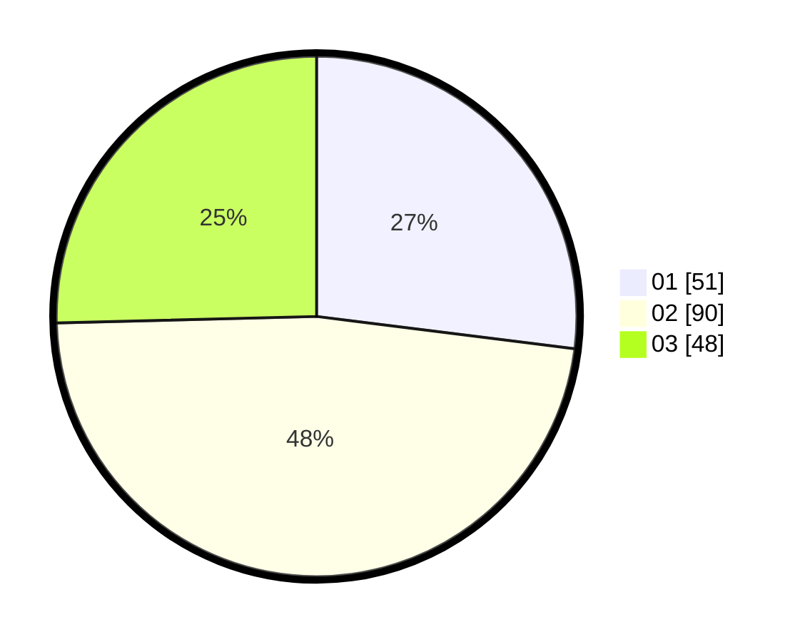

# Hasil

Hasil perolehan suara paslon dapat dilihat pada file paslon-01.txt, paslon-02.txt, dan paslon-03.txt.

Jika tidak ada, artinya data tersebut belum ada pada SIREKAP.

## Perolehan Suara

 * Paslon 01: **51**.
 * Paslon 02: **90**.
 * Paslon 03: **48**.

## Foto C Plano

https://sirekap-obj-formc.kpu.go.id/3664/pemilu/ppwp/31/71/01/10/02/3171011002032-20240214-193611--917a209e-f669-431d-87bb-145640cdc439.jpg

https://sirekap-obj-formc.kpu.go.id/3664/pemilu/ppwp/31/71/01/10/02/3171011002032-20240214-193615--3c31848f-7fed-4c89-b8ca-cd66c8f11daa.jpg

https://sirekap-obj-formc.kpu.go.id/3664/pemilu/ppwp/31/71/01/10/02/3171011002032-20240214-193619--531d2799-89f7-4014-80cd-3b8f9a5382b1.jpg

## DATA PEMILIH TETAP

Jumlah pemilih dalam DPT: **252**.
 * L: **120**.
 * P: **132**.

## DATA PENGGUNA HAK PILIH

Jumlah pengguna hak pilih dalam DPT: **189**.
 * L: **93**.
 * P: **96**.

Jumlah pengguna hak pilih dalam DPTb: **3**.
 * L: **0**.
 * P: **3**.

Jumlah pengguna hak pilih dalam DPK: **0**.
 * L: **0**.
 * P: **0**.

Jumlah pengguna hak pilih: **192**.
 * L: **93**.
 * P: **99**.

## JUMLAH SUARA SAH DAN TIDAK SAH

JUMLAH SELURUH SUARA SAH: **189**.

JUMLAH SUARA TIDAK SAH: **3**.

JUMLAH SELURUH SUARA SAH DAN SUARA TIDAK SAH: **192**.
