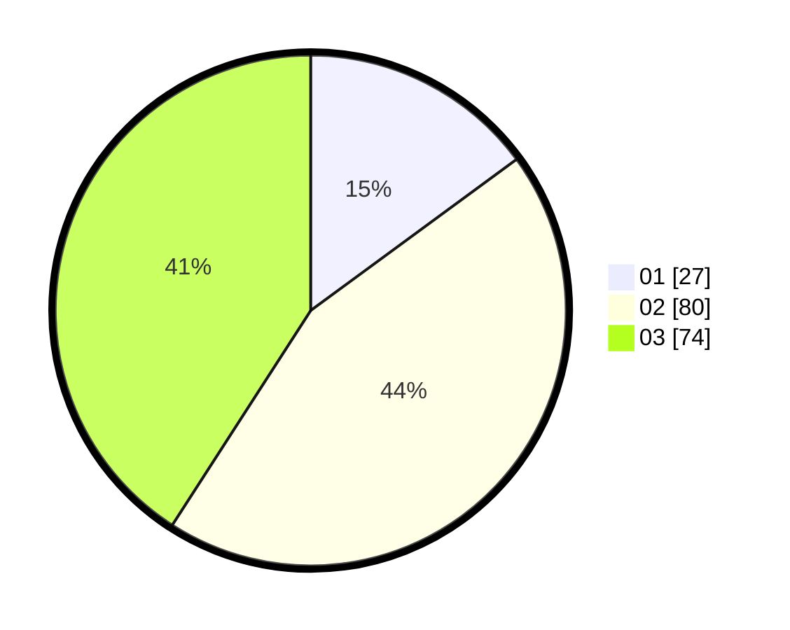

# Hasil

Hasil perolehan suara paslon dapat dilihat pada file paslon-01.txt, paslon-02.txt, dan paslon-03.txt.

Jika tidak ada, artinya data tersebut belum ada pada SIREKAP.

## Perolehan Suara

 * Paslon 01: **27**.
 * Paslon 02: **80**.
 * Paslon 03: **74**.

## Foto C Plano

https://sirekap-obj-formc.kpu.go.id/60c7/pemilu/ppwp/31/71/01/10/02/3171011002033-20240216-025731--04fce34b-dcfa-4a13-b318-58e8dc5d1863.jpg

https://sirekap-obj-formc.kpu.go.id/60c7/pemilu/ppwp/31/71/01/10/02/3171011002033-20240216-025734--aa2c844a-fa06-4f36-a647-ba8b4aadb255.jpg

https://sirekap-obj-formc.kpu.go.id/60c7/pemilu/ppwp/31/71/01/10/02/3171011002033-20240216-025732--c31df6e7-0aad-445d-9007-8634c1f5394c.jpg

## DATA PEMILIH TETAP

Jumlah pemilih dalam DPT: **251**.
 * L: **125**.
 * P: **126**.

## DATA PENGGUNA HAK PILIH

Jumlah pengguna hak pilih dalam DPT: **183**.
 * L: **87**.
 * P: **96**.

Jumlah pengguna hak pilih dalam DPTb: **0**.
 * L: **0**.
 * P: **0**.

Jumlah pengguna hak pilih dalam DPK: **0**.
 * L: **0**.
 * P: **0**.

Jumlah pengguna hak pilih: **183**.
 * L: **87**.
 * P: **96**.

## JUMLAH SUARA SAH DAN TIDAK SAH

JUMLAH SELURUH SUARA SAH: **181**.

JUMLAH SUARA TIDAK SAH: **2**.

JUMLAH SELURUH SUARA SAH DAN SUARA TIDAK SAH: **183**.
