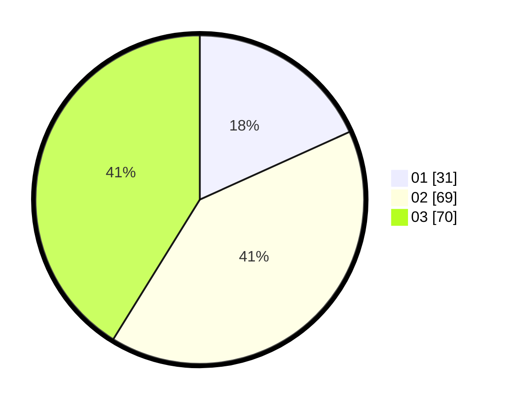

# Hasil

Hasil perolehan suara paslon dapat dilihat pada file paslon-01.txt, paslon-02.txt, dan paslon-03.txt.

Jika tidak ada, artinya data tersebut belum ada pada SIREKAP.

## Perolehan Suara

 * Paslon 01: **31**.
 * Paslon 02: **69**.
 * Paslon 03: **70**.

## Foto C Plano

https://sirekap-obj-formc.kpu.go.id/5747/pemilu/ppwp/31/71/01/10/02/3171011002035-20240216-013953--11e827e6-1a81-4833-8072-43c348274512.jpg

https://sirekap-obj-formc.kpu.go.id/5747/pemilu/ppwp/31/71/01/10/02/3171011002035-20240214-193050--e66a73f6-cecf-46c4-8f29-e427daf54f44.jpg

https://sirekap-obj-formc.kpu.go.id/5747/pemilu/ppwp/31/71/01/10/02/3171011002035-20240214-193118--3bf38406-d65c-4bf2-8340-204d7d883d72.jpg

## DATA PEMILIH TETAP

Jumlah pemilih dalam DPT: **237**.
 * L: **119**.
 * P: **118**.

## DATA PENGGUNA HAK PILIH

Jumlah pengguna hak pilih dalam DPT: **169**.
 * L: **85**.
 * P: **84**.

Jumlah pengguna hak pilih dalam DPTb: **0**.
 * L: **0**.
 * P: **0**.

Jumlah pengguna hak pilih dalam DPK: **7**.
 * L: **1**.
 * P: **6**.

Jumlah pengguna hak pilih: **176**.
 * L: **85**.
 * P: **91**.

## JUMLAH SUARA SAH DAN TIDAK SAH

JUMLAH SELURUH SUARA SAH: **170**.

JUMLAH SUARA TIDAK SAH: **6**.

JUMLAH SELURUH SUARA SAH DAN SUARA TIDAK SAH: **176**.
