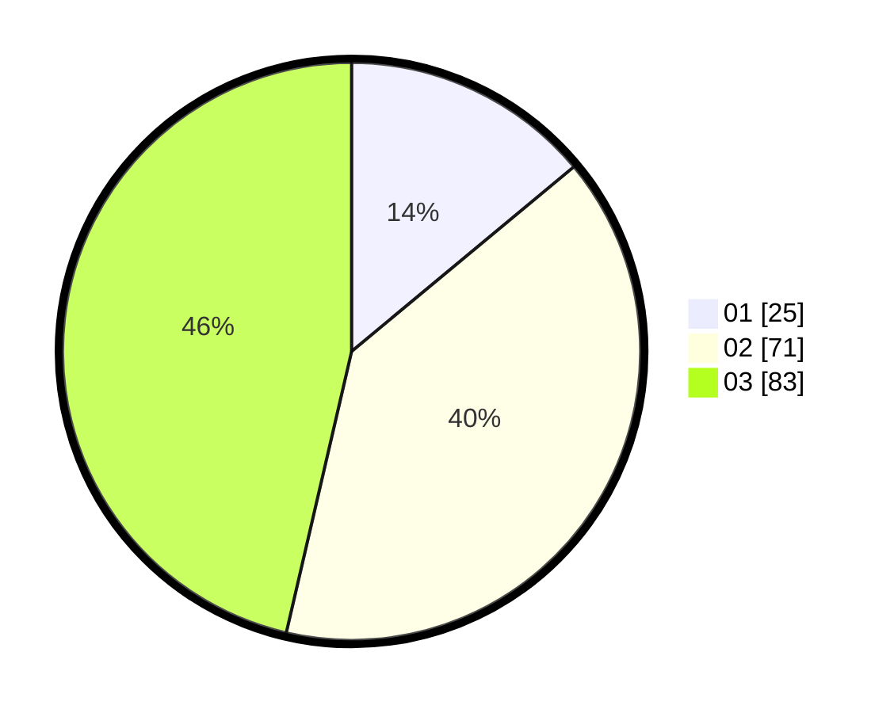

# Hasil

Hasil perolehan suara paslon dapat dilihat pada file paslon-01.txt, paslon-02.txt, dan paslon-03.txt.

Jika tidak ada, artinya data tersebut belum ada pada SIREKAP.

## Perolehan Suara

 * Paslon 01: **25**.
 * Paslon 02: **71**.
 * Paslon 03: **83**.

## Foto C Plano

https://sirekap-obj-formc.kpu.go.id/edf6/pemilu/ppwp/31/71/01/10/02/3171011002037-20240216-142014--97bc97af-1b82-42f2-a659-20ecc635903b.jpg

https://sirekap-obj-formc.kpu.go.id/edf6/pemilu/ppwp/31/71/01/10/02/3171011002037-20240216-142016--89892d24-8e20-46ec-9104-ed865d0ed583.jpg

https://sirekap-obj-formc.kpu.go.id/edf6/pemilu/ppwp/31/71/01/10/02/3171011002037-20240216-142015--f0309119-8b12-42e3-91fd-eeb94dd02311.jpg

## DATA PEMILIH TETAP

Jumlah pemilih dalam DPT: **259**.
 * L: **122**.
 * P: **137**.

## DATA PENGGUNA HAK PILIH

Jumlah pengguna hak pilih dalam DPT: **167**.
 * L: **77**.
 * P: **90**.

Jumlah pengguna hak pilih dalam DPTb: **7**.
 * L: **5**.
 * P: **2**.

Jumlah pengguna hak pilih dalam DPK: **6**.
 * L: **5**.
 * P: **1**.

Jumlah pengguna hak pilih: **180**.
 * L: **87**.
 * P: **93**.

## JUMLAH SUARA SAH DAN TIDAK SAH

JUMLAH SELURUH SUARA SAH: **179**.

JUMLAH SUARA TIDAK SAH: **1**.

JUMLAH SELURUH SUARA SAH DAN SUARA TIDAK SAH: **180**.
