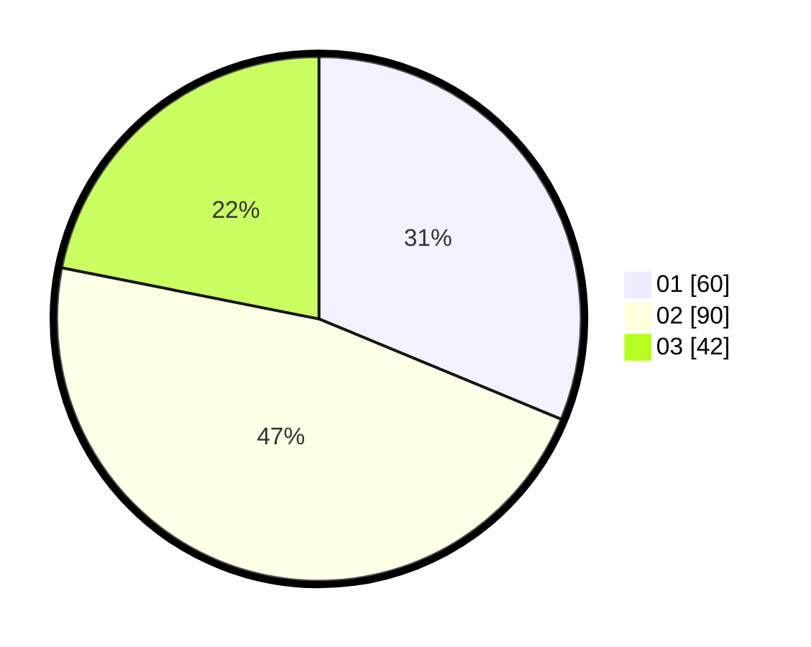

# Hasil

Hasil perolehan suara paslon dapat dilihat pada file paslon-01.txt, paslon-02.txt, dan paslon-03.txt.

Jika tidak ada, artinya data tersebut belum ada pada SIREKAP.

## Perolehan Suara

 * Paslon 01: **60**.
 * Paslon 02: **90**.
 * Paslon 03: **42**.

## Foto C Plano

https://sirekap-obj-formc.kpu.go.id/1d70/pemilu/ppwp/31/71/01/10/02/3171011002039-20240214-162246--36ba32b1-9230-4262-a7c2-f5ee04afe8e4.jpg

https://sirekap-obj-formc.kpu.go.id/1d70/pemilu/ppwp/31/71/01/10/02/3171011002039-20240214-155905--9d693e2c-7baf-4552-bc1e-e2f0809706a8.jpg

https://sirekap-obj-formc.kpu.go.id/1d70/pemilu/ppwp/31/71/01/10/02/3171011002039-20240215-215711--6fb70f70-245a-40b2-a49f-37c4cc002838.jpg

## DATA PEMILIH TETAP

Jumlah pemilih dalam DPT: **245**.
 * L: **111**.
 * P: **134**.

## DATA PENGGUNA HAK PILIH

Jumlah pengguna hak pilih dalam DPT: **180**.
 * L: **79**.
 * P: **101**.

Jumlah pengguna hak pilih dalam DPTb: **14**.
 * L: **5**.
 * P: **9**.

Jumlah pengguna hak pilih dalam DPK: **1**.
 * L: **0**.
 * P: **1**.

Jumlah pengguna hak pilih: **195**.
 * L: **84**.
 * P: **111**.

## JUMLAH SUARA SAH DAN TIDAK SAH

JUMLAH SELURUH SUARA SAH: **192**.

JUMLAH SUARA TIDAK SAH: **3**.

JUMLAH SELURUH SUARA SAH DAN SUARA TIDAK SAH: **195**.
