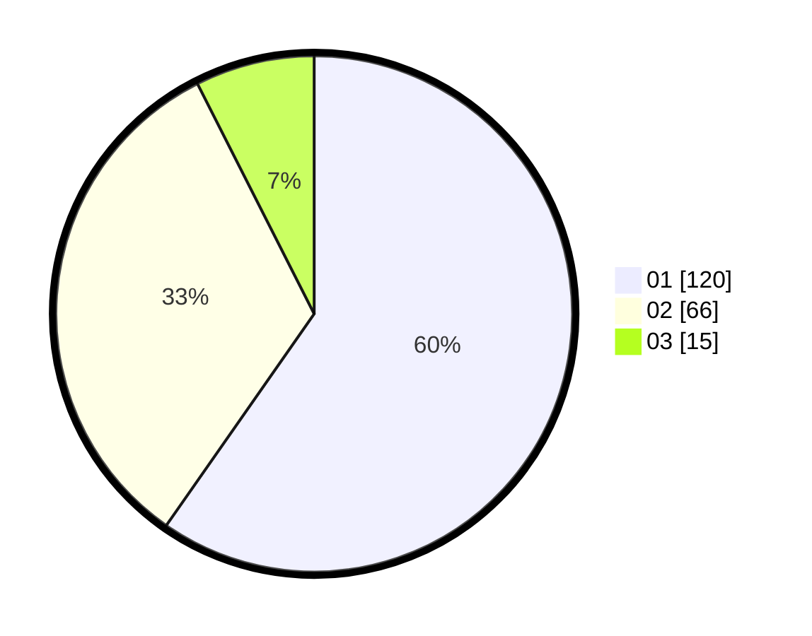

# Hasil

Hasil perolehan suara paslon dapat dilihat pada file paslon-01.txt, paslon-02.txt, dan paslon-03.txt.

Jika tidak ada, artinya data tersebut belum ada pada SIREKAP.

## Perolehan Suara

 * Paslon 01: **120**.
 * Paslon 02: **66**.
 * Paslon 03: **15**.

## Foto C Plano

https://sirekap-obj-formc.kpu.go.id/e90b/pemilu/ppwp/31/71/01/10/02/3171011002042-20240214-232849--dfc2c4c7-e713-48b6-94b0-f57e8eda6fe4.jpg

https://sirekap-obj-formc.kpu.go.id/e90b/pemilu/ppwp/31/71/01/10/02/3171011002042-20240214-232954--6249cb15-2b1d-4b46-91bc-47ee41ce9c4e.jpg

https://sirekap-obj-formc.kpu.go.id/e90b/pemilu/ppwp/31/71/01/10/02/3171011002042-20240214-233050--29735603-d9ae-4e4e-a8e3-d112cee403ca.jpg

## DATA PEMILIH TETAP

Jumlah pemilih dalam DPT: **286**.
 * L: **145**.
 * P: **141**.

## DATA PENGGUNA HAK PILIH

Jumlah pengguna hak pilih dalam DPT: **199**.
 * L: **98**.
 * P: **101**.

Jumlah pengguna hak pilih dalam DPTb: **5**.
 * L: **3**.
 * P: **2**.

Jumlah pengguna hak pilih dalam DPK: **0**.
 * L: **0**.
 * P: **0**.

Jumlah pengguna hak pilih: **204**.
 * L: **101**.
 * P: **103**.

## JUMLAH SUARA SAH DAN TIDAK SAH

JUMLAH SELURUH SUARA SAH: **201**.

JUMLAH SUARA TIDAK SAH: **3**.

JUMLAH SELURUH SUARA SAH DAN SUARA TIDAK SAH: **204**.
