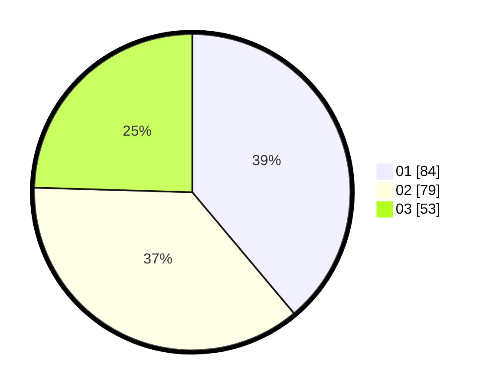

# Hasil

Hasil perolehan suara paslon dapat dilihat pada file paslon-01.txt, paslon-02.txt, dan paslon-03.txt.

Jika tidak ada, artinya data tersebut belum ada pada SIREKAP.

## Perolehan Suara

 * Paslon 01: **84**.
 * Paslon 02: **79**.
 * Paslon 03: **53**.

## Foto C Plano

https://sirekap-obj-formc.kpu.go.id/e0f0/pemilu/ppwp/31/71/01/10/02/3171011002046-20240215-212350--0597df3e-ac0b-472a-bd85-d3eed63a6b5a.jpg

https://sirekap-obj-formc.kpu.go.id/e0f0/pemilu/ppwp/31/71/01/10/02/3171011002046-20240215-212353--f703a7f1-a0e1-4ef5-8d55-4fd53c03ee30.jpg

https://sirekap-obj-formc.kpu.go.id/e0f0/pemilu/ppwp/31/71/01/10/02/3171011002046-20240215-212351--15973bd3-3add-4dd3-9ed1-cc2ba275aa71.jpg

## DATA PEMILIH TETAP

Jumlah pemilih dalam DPT: **287**.
 * L: **151**.
 * P: **136**.

## DATA PENGGUNA HAK PILIH

Jumlah pengguna hak pilih dalam DPT: **210**.
 * L: **115**.
 * P: **95**.

Jumlah pengguna hak pilih dalam DPTb: **7**.
 * L: **3**.
 * P: **4**.

Jumlah pengguna hak pilih dalam DPK: **3**.
 * L: **2**.
 * P: **1**.

Jumlah pengguna hak pilih: **220**.
 * L: **120**.
 * P: **100**.

## JUMLAH SUARA SAH DAN TIDAK SAH

JUMLAH SELURUH SUARA SAH: **216**.

JUMLAH SUARA TIDAK SAH: **4**.

JUMLAH SELURUH SUARA SAH DAN SUARA TIDAK SAH: **220**.
