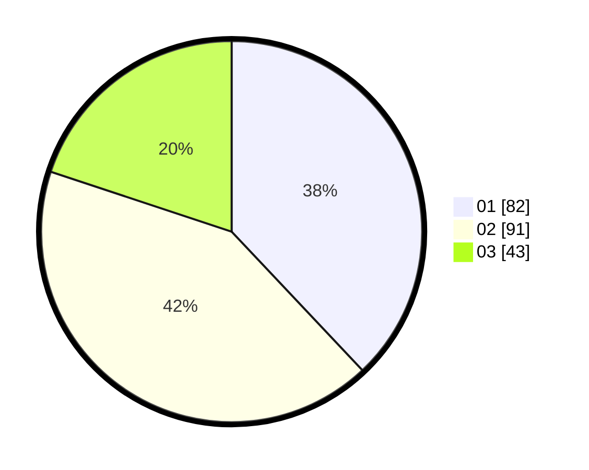

# Hasil

Hasil perolehan suara paslon dapat dilihat pada file paslon-01.txt, paslon-02.txt, dan paslon-03.txt.

Jika tidak ada, artinya data tersebut belum ada pada SIREKAP.

## Perolehan Suara

 * Paslon 01: **82**.
 * Paslon 02: **91**.
 * Paslon 03: **43**.

## Foto C Plano

https://sirekap-obj-formc.kpu.go.id/efc4/pemilu/ppwp/31/71/01/10/02/3171011002049-20240214-202140--3a3c3ac5-0bb9-4aed-84ab-c5a4b975156c.jpg

https://sirekap-obj-formc.kpu.go.id/efc4/pemilu/ppwp/31/71/01/10/02/3171011002049-20240214-202557--d9c8d7ff-96f3-46c9-afe5-8a89e0fbce55.jpg

https://sirekap-obj-formc.kpu.go.id/efc4/pemilu/ppwp/31/71/01/10/02/3171011002049-20240214-202728--cc292620-2a8d-4e66-a8bf-0186520cd5c7.jpg

## DATA PEMILIH TETAP

Jumlah pemilih dalam DPT: **265**.
 * L: **112**.
 * P: **153**.

## DATA PENGGUNA HAK PILIH

Jumlah pengguna hak pilih dalam DPT: **214**.
 * L: **85**.
 * P: **129**.

Jumlah pengguna hak pilih dalam DPTb: **1**.
 * L: **0**.
 * P: **1**.

Jumlah pengguna hak pilih dalam DPK: **6**.
 * L: **3**.
 * P: **3**.

Jumlah pengguna hak pilih: **221**.
 * L: **88**.
 * P: **133**.

## JUMLAH SUARA SAH DAN TIDAK SAH

JUMLAH SELURUH SUARA SAH: **216**.

JUMLAH SUARA TIDAK SAH: **5**.

JUMLAH SELURUH SUARA SAH DAN SUARA TIDAK SAH: **221**.
