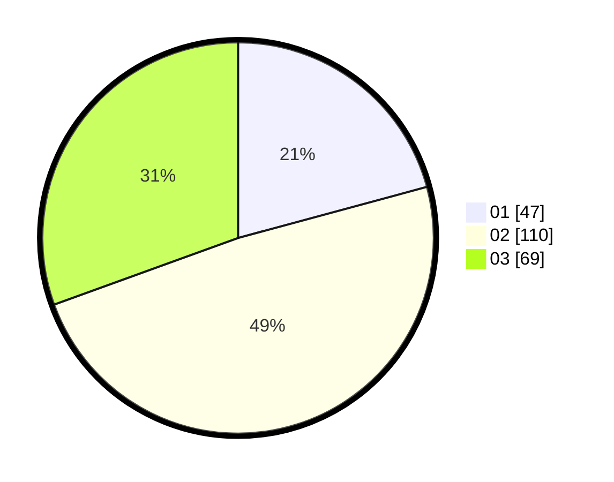

# Hasil

Hasil perolehan suara paslon dapat dilihat pada file paslon-01.txt, paslon-02.txt, dan paslon-03.txt.

Jika tidak ada, artinya data tersebut belum ada pada SIREKAP.

## Perolehan Suara

 * Paslon 01: **47**.
 * Paslon 02: **110**.
 * Paslon 03: **69**.

## Foto C Plano

https://sirekap-obj-formc.kpu.go.id/c4e9/pemilu/ppwp/31/71/01/10/02/3171011002051-20240216-224307--33a782c0-9622-4be1-9e43-d2da5730ff27.jpg

https://sirekap-obj-formc.kpu.go.id/c4e9/pemilu/ppwp/31/71/01/10/02/3171011002051-20240216-224308--3182e2c4-c3a3-4d5a-a8d3-21217e9bcce8.jpg

https://sirekap-obj-formc.kpu.go.id/c4e9/pemilu/ppwp/31/71/01/10/02/3171011002051-20240216-224307--8fdd32f3-e9d2-4477-926c-548f7a7e19b8.jpg

## DATA PEMILIH TETAP

Jumlah pemilih dalam DPT: **265**.
 * L: **111**.
 * P: **154**.

## DATA PENGGUNA HAK PILIH

Jumlah pengguna hak pilih dalam DPT: **223**.
 * L: **98**.
 * P: **135**.

Jumlah pengguna hak pilih dalam DPTb: **1**.
 * L: **1**.
 * P: **0**.

Jumlah pengguna hak pilih dalam DPK: **2**.
 * L: **1**.
 * P: **1**.

Jumlah pengguna hak pilih: **226**.
 * L: **90**.
 * P: **136**.

## JUMLAH SUARA SAH DAN TIDAK SAH

JUMLAH SELURUH SUARA SAH: **226**.

JUMLAH SUARA TIDAK SAH: **0**.

JUMLAH SELURUH SUARA SAH DAN SUARA TIDAK SAH: **226**.
