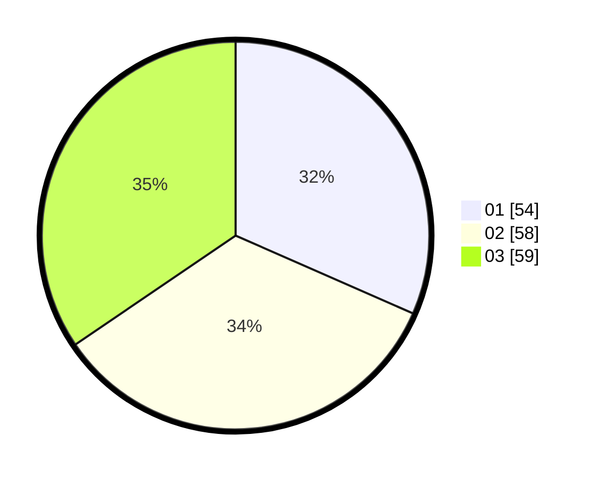

# Hasil

Hasil perolehan suara paslon dapat dilihat pada file paslon-01.txt, paslon-02.txt, dan paslon-03.txt.

Jika tidak ada, artinya data tersebut belum ada pada SIREKAP.

## Perolehan Suara

 * Paslon 01: **54**.
 * Paslon 02: **58**.
 * Paslon 03: **59**.

## Foto C Plano

https://sirekap-obj-formc.kpu.go.id/34e1/pemilu/ppwp/31/71/01/10/02/3171011002052-20240214-225236--fdcb6325-5b97-4de6-8399-b5d6194af253.jpg

https://sirekap-obj-formc.kpu.go.id/34e1/pemilu/ppwp/31/71/01/10/02/3171011002052-20240215-153059--74e1454a-26a5-48fc-b001-7abb52766c08.jpg

https://sirekap-obj-formc.kpu.go.id/34e1/pemilu/ppwp/31/71/01/10/02/3171011002052-20240214-225622--62ac94d7-c04c-4d47-bc12-76459190fdd7.jpg

## DATA PEMILIH TETAP

Jumlah pemilih dalam DPT: **228**.
 * L: **107**.
 * P: **121**.

## DATA PENGGUNA HAK PILIH

Jumlah pengguna hak pilih dalam DPT: **164**.
 * L: **74**.
 * P: **90**.

Jumlah pengguna hak pilih dalam DPTb: **9**.
 * L: **0**.
 * P: **9**.

Jumlah pengguna hak pilih dalam DPK: **1**.
 * L: **0**.
 * P: **1**.

Jumlah pengguna hak pilih: **174**.
 * L: **74**.
 * P: **100**.

## JUMLAH SUARA SAH DAN TIDAK SAH

JUMLAH SELURUH SUARA SAH: **171**.

JUMLAH SUARA TIDAK SAH: **3**.

JUMLAH SELURUH SUARA SAH DAN SUARA TIDAK SAH: **174**.
