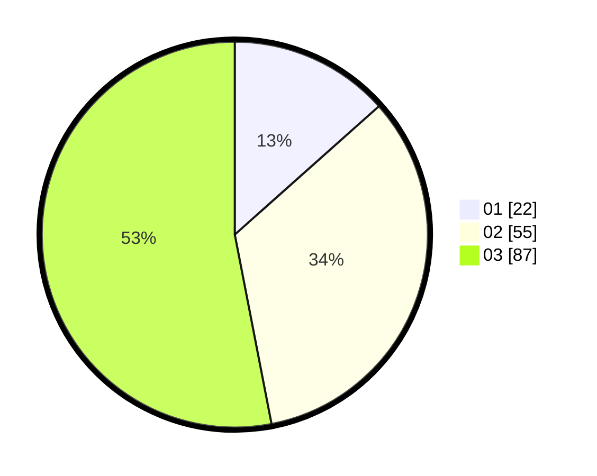

# Hasil

Hasil perolehan suara paslon dapat dilihat pada file paslon-01.txt, paslon-02.txt, dan paslon-03.txt.

Jika tidak ada, artinya data tersebut belum ada pada SIREKAP.

## Perolehan Suara

 * Paslon 01: **22**.
 * Paslon 02: **55**.
 * Paslon 03: **87**.

## Foto C Plano

https://sirekap-obj-formc.kpu.go.id/5e79/pemilu/ppwp/31/71/01/10/02/3171011002054-20240215-144222--ba41d68c-e02f-4d9f-aa2a-f3a2ef87c0cf.jpg

https://sirekap-obj-formc.kpu.go.id/5e79/pemilu/ppwp/31/71/01/10/02/3171011002054-20240215-144246--ecd04e4b-8816-413b-b8b5-714ad9c43a27.jpg

https://sirekap-obj-formc.kpu.go.id/5e79/pemilu/ppwp/31/71/01/10/02/3171011002054-20240215-144233--d6273183-79e4-4175-87a6-6de9ea040c21.jpg

## DATA PEMILIH TETAP

Jumlah pemilih dalam DPT: **214**.
 * L: **104**.
 * P: **110**.

## DATA PENGGUNA HAK PILIH

Jumlah pengguna hak pilih dalam DPT: **152**.
 * L: **78**.
 * P: **74**.

Jumlah pengguna hak pilih dalam DPTb: **12**.
 * L: **6**.
 * P: **6**.

Jumlah pengguna hak pilih dalam DPK: **1**.
 * L: **0**.
 * P: **1**.

Jumlah pengguna hak pilih: **165**.
 * L: **84**.
 * P: **81**.

## JUMLAH SUARA SAH DAN TIDAK SAH

JUMLAH SELURUH SUARA SAH: **164**.

JUMLAH SUARA TIDAK SAH: **1**.

JUMLAH SELURUH SUARA SAH DAN SUARA TIDAK SAH: **165**.
