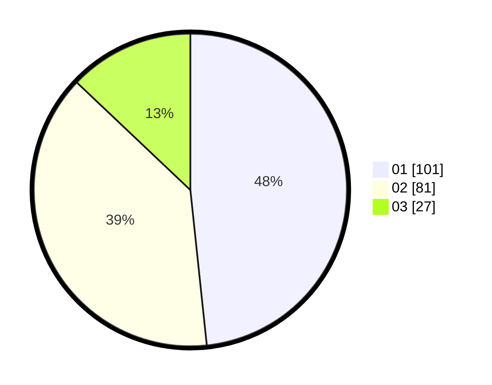

# Hasil

Hasil perolehan suara paslon dapat dilihat pada file paslon-01.txt, paslon-02.txt, dan paslon-03.txt.

Jika tidak ada, artinya data tersebut belum ada pada SIREKAP.

## Perolehan Suara

 * Paslon 01: **101**.
 * Paslon 02: **81**.
 * Paslon 03: **27**.

## Foto C Plano

https://sirekap-obj-formc.kpu.go.id/a892/pemilu/ppwp/31/71/01/10/03/3171011003001-20240214-195136--4c189ed8-25c8-403c-85a9-c19210458aa3.jpg

https://sirekap-obj-formc.kpu.go.id/a892/pemilu/ppwp/31/71/01/10/03/3171011003001-20240214-195200--ec6d030d-d6ea-46d7-9e9d-b9ec174ee246.jpg

https://sirekap-obj-formc.kpu.go.id/a892/pemilu/ppwp/31/71/01/10/03/3171011003001-20240214-195219--f62ba1d0-39cd-4991-a6f6-db572e392960.jpg

## DATA PEMILIH TETAP

Jumlah pemilih dalam DPT: **284**.
 * L: **142**.
 * P: **142**.

## DATA PENGGUNA HAK PILIH

Jumlah pengguna hak pilih dalam DPT: **198**.
 * L: **99**.
 * P: **99**.

Jumlah pengguna hak pilih dalam DPTb: **13**.
 * L: **5**.
 * P: **8**.

Jumlah pengguna hak pilih dalam DPK: **1**.
 * L: **1**.
 * P: **0**.

Jumlah pengguna hak pilih: **212**.
 * L: **105**.
 * P: **107**.

## JUMLAH SUARA SAH DAN TIDAK SAH

JUMLAH SELURUH SUARA SAH: **209**.

JUMLAH SUARA TIDAK SAH: **3**.

JUMLAH SELURUH SUARA SAH DAN SUARA TIDAK SAH: **212**.
