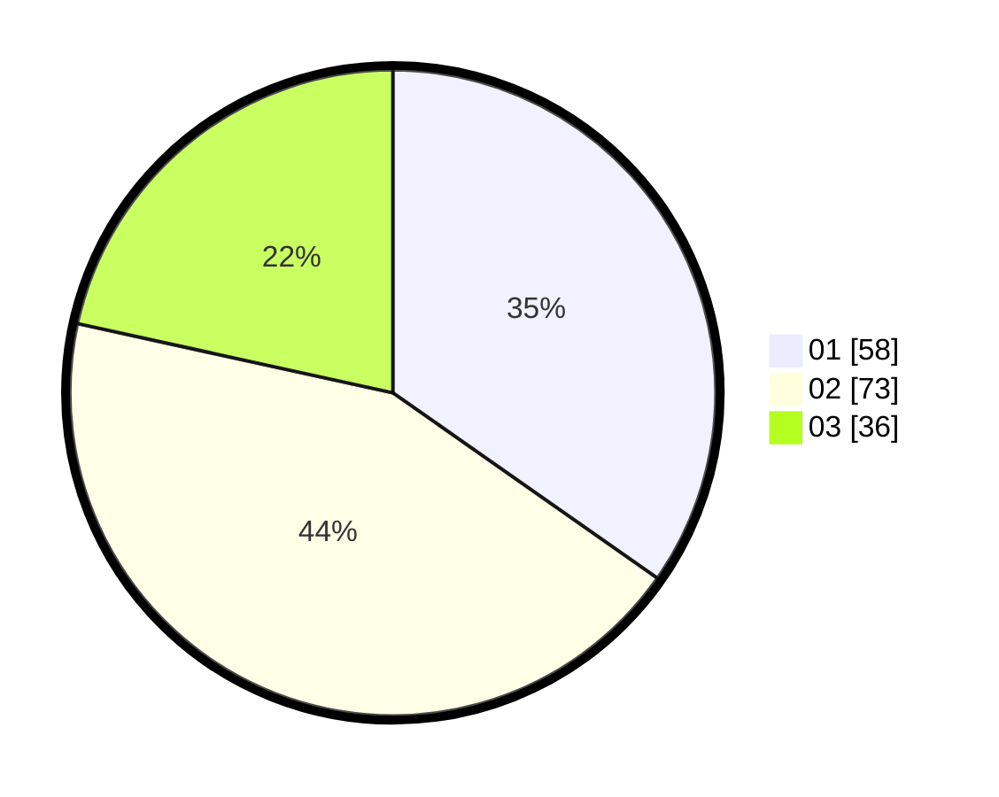

# Hasil

Hasil perolehan suara paslon dapat dilihat pada file paslon-01.txt, paslon-02.txt, dan paslon-03.txt.

Jika tidak ada, artinya data tersebut belum ada pada SIREKAP.

## Perolehan Suara

 * Paslon 01: **58**.
 * Paslon 02: **73**.
 * Paslon 03: **36**.

## Foto C Plano

https://sirekap-obj-formc.kpu.go.id/08ae/pemilu/ppwp/31/71/01/10/03/3171011003013-20240217-171345--5ca8c9a0-f06b-45d8-b1d7-3c64e54c3b20.jpg

https://sirekap-obj-formc.kpu.go.id/08ae/pemilu/ppwp/31/71/01/10/03/3171011003013-20240217-171346--d7b5d50b-f857-4755-9933-ffa7b9eaf970.jpg

https://sirekap-obj-formc.kpu.go.id/08ae/pemilu/ppwp/31/71/01/10/03/3171011003013-20240217-171345--fa8c2b18-ce73-4b3c-bafd-296f33c61224.jpg

## DATA PEMILIH TETAP

Jumlah pemilih dalam DPT: **249**.
 * L: **133**.
 * P: **116**.

## DATA PENGGUNA HAK PILIH

Jumlah pengguna hak pilih dalam DPT: **160**.
 * L: **91**.
 * P: **69**.

Jumlah pengguna hak pilih dalam DPTb: **6**.
 * L: **2**.
 * P: **4**.

Jumlah pengguna hak pilih dalam DPK: **3**.
 * L: **1**.
 * P: **2**.

Jumlah pengguna hak pilih: **169**.
 * L: **94**.
 * P: **75**.

## JUMLAH SUARA SAH DAN TIDAK SAH

JUMLAH SELURUH SUARA SAH: **167**.

JUMLAH SUARA TIDAK SAH: **4**.

JUMLAH SELURUH SUARA SAH DAN SUARA TIDAK SAH: **171**.
