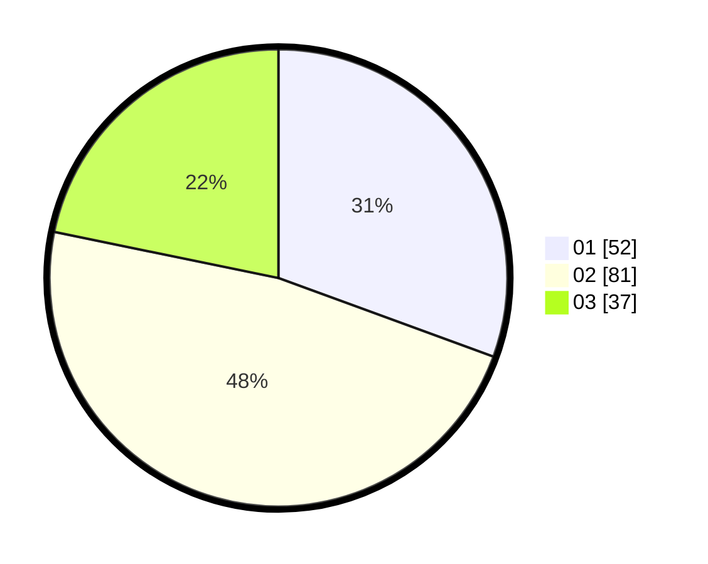

# Hasil

Hasil perolehan suara paslon dapat dilihat pada file paslon-01.txt, paslon-02.txt, dan paslon-03.txt.

Jika tidak ada, artinya data tersebut belum ada pada SIREKAP.

## Perolehan Suara

 * Paslon 01: **52**.
 * Paslon 02: **81**.
 * Paslon 03: **37**.

## Foto C Plano

https://sirekap-obj-formc.kpu.go.id/9a6c/pemilu/ppwp/31/71/01/10/03/3171011003014-20240214-155238--84e8cce6-576e-4e41-b1ac-20ba2f684617.jpg

https://sirekap-obj-formc.kpu.go.id/9a6c/pemilu/ppwp/31/71/01/10/03/3171011003014-20240214-155058--4929c40b-ee5d-4459-b332-162584bb4942.jpg

https://sirekap-obj-formc.kpu.go.id/9a6c/pemilu/ppwp/31/71/01/10/03/3171011003014-20240214-155147--6bf70573-cfd7-42d6-a7c6-a94e41f386a7.jpg

## DATA PEMILIH TETAP

Jumlah pemilih dalam DPT: **247**.
 * L: **121**.
 * P: **126**.

## DATA PENGGUNA HAK PILIH

Jumlah pengguna hak pilih dalam DPT: **165**.
 * L: **87**.
 * P: **78**.

Jumlah pengguna hak pilih dalam DPTb: **4**.
 * L: **2**.
 * P: **2**.

Jumlah pengguna hak pilih dalam DPK: **3**.
 * L: **2**.
 * P: **1**.

Jumlah pengguna hak pilih: **172**.
 * L: **91**.
 * P: **81**.

## JUMLAH SUARA SAH DAN TIDAK SAH

JUMLAH SELURUH SUARA SAH: **170**.

JUMLAH SUARA TIDAK SAH: **2**.

JUMLAH SELURUH SUARA SAH DAN SUARA TIDAK SAH: **172**.
