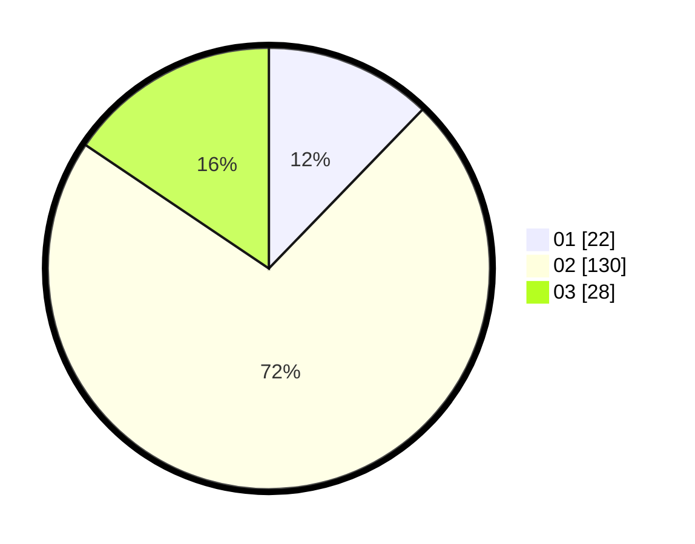

# Hasil

Hasil perolehan suara paslon dapat dilihat pada file paslon-01.txt, paslon-02.txt, dan paslon-03.txt.

Jika tidak ada, artinya data tersebut belum ada pada SIREKAP.

## Perolehan Suara

 * Paslon 01: **22**.
 * Paslon 02: **130**.
 * Paslon 03: **28**.

## Foto C Plano

https://sirekap-obj-formc.kpu.go.id/a794/pemilu/ppwp/31/71/01/10/03/3171011003015-20240214-203927--57533362-5323-43ac-805a-27f0b9aa144b.jpg

https://sirekap-obj-formc.kpu.go.id/a794/pemilu/ppwp/31/71/01/10/03/3171011003015-20240214-203950--78e10cda-4d9d-48d0-9737-e3e257199c9a.jpg

https://sirekap-obj-formc.kpu.go.id/a794/pemilu/ppwp/31/71/01/10/03/3171011003015-20240214-204019--d0db5288-b4da-4fe3-bce8-97c68d97a6ef.jpg

## DATA PEMILIH TETAP

Jumlah pemilih dalam DPT: **239**.
 * L: **118**.
 * P: **121**.

## DATA PENGGUNA HAK PILIH

Jumlah pengguna hak pilih dalam DPT: **174**.
 * L: **82**.
 * P: **92**.

Jumlah pengguna hak pilih dalam DPTb: **5**.
 * L: **0**.
 * P: **5**.

Jumlah pengguna hak pilih dalam DPK: **2**.
 * L: **2**.
 * P: **0**.

Jumlah pengguna hak pilih: **181**.
 * L: **84**.
 * P: **97**.

## JUMLAH SUARA SAH DAN TIDAK SAH

JUMLAH SELURUH SUARA SAH: **180**.

JUMLAH SUARA TIDAK SAH: **1**.

JUMLAH SELURUH SUARA SAH DAN SUARA TIDAK SAH: **181**.
