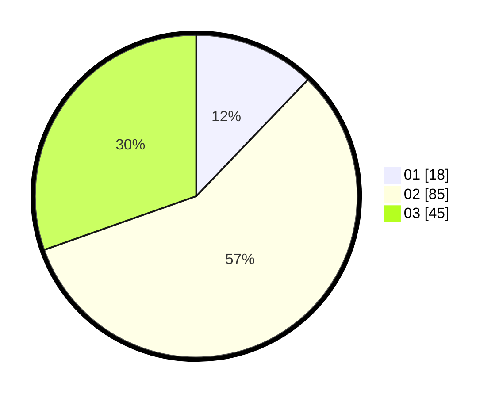

# Hasil

Hasil perolehan suara paslon dapat dilihat pada file paslon-01.txt, paslon-02.txt, dan paslon-03.txt.

Jika tidak ada, artinya data tersebut belum ada pada SIREKAP.

## Perolehan Suara

 * Paslon 01: **18**.
 * Paslon 02: **85**.
 * Paslon 03: **45**.

## Foto C Plano

https://sirekap-obj-formc.kpu.go.id/77d5/pemilu/ppwp/31/71/01/10/03/3171011003016-20240216-224226--04a63732-c8ef-4559-86c2-b3967819bbac.jpg

https://sirekap-obj-formc.kpu.go.id/77d5/pemilu/ppwp/31/71/01/10/03/3171011003016-20240216-224227--b1202b6d-1e02-439d-b5f2-5548601fa3c3.jpg

https://sirekap-obj-formc.kpu.go.id/77d5/pemilu/ppwp/31/71/01/10/03/3171011003016-20240216-224226--f593a7d0-9ab0-40a7-83f0-d319562ccfa3.jpg

## DATA PEMILIH TETAP

Jumlah pemilih dalam DPT: **234**.
 * L: **108**.
 * P: **126**.

## DATA PENGGUNA HAK PILIH

Jumlah pengguna hak pilih dalam DPT: **142**.
 * L: **64**.
 * P: **78**.

Jumlah pengguna hak pilih dalam DPTb: **5**.
 * L: **1**.
 * P: **4**.

Jumlah pengguna hak pilih dalam DPK: **2**.
 * L: **0**.
 * P: **2**.

Jumlah pengguna hak pilih: **149**.
 * L: **65**.
 * P: **84**.

## JUMLAH SUARA SAH DAN TIDAK SAH

JUMLAH SELURUH SUARA SAH: **148**.

JUMLAH SUARA TIDAK SAH: **1**.

JUMLAH SELURUH SUARA SAH DAN SUARA TIDAK SAH: **149**.
