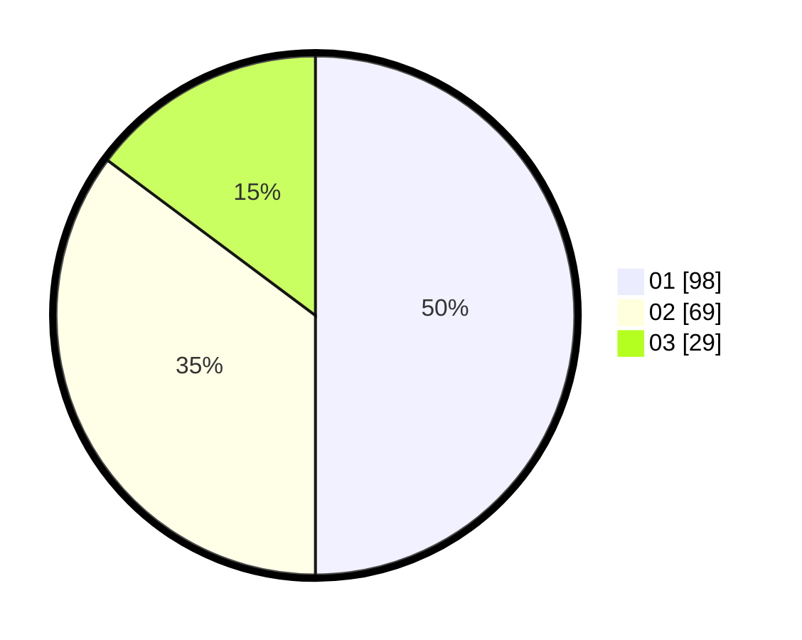

# Hasil

Hasil perolehan suara paslon dapat dilihat pada file paslon-01.txt, paslon-02.txt, dan paslon-03.txt.

Jika tidak ada, artinya data tersebut belum ada pada SIREKAP.

## Perolehan Suara

 * Paslon 01: **98**.
 * Paslon 02: **69**.
 * Paslon 03: **29**.

## Foto C Plano

https://sirekap-obj-formc.kpu.go.id/af4c/pemilu/ppwp/31/71/01/10/03/3171011003018-20240215-020528--2d73671c-7dda-41b0-ac5b-f3a40fc38dc5.jpg

https://sirekap-obj-formc.kpu.go.id/af4c/pemilu/ppwp/31/71/01/10/03/3171011003018-20240215-020639--c88e55ac-3220-4365-8731-6035137b16ed.jpg

https://sirekap-obj-formc.kpu.go.id/af4c/pemilu/ppwp/31/71/01/10/03/3171011003018-20240215-020719--d40db9a7-64cb-4b2a-a96c-5b04d1fa3214.jpg

## DATA PEMILIH TETAP

Jumlah pemilih dalam DPT: **265**.
 * L: **124**.
 * P: **141**.

## DATA PENGGUNA HAK PILIH

Jumlah pengguna hak pilih dalam DPT: **203**.
 * L: **89**.
 * P: **114**.

Jumlah pengguna hak pilih dalam DPTb: **1**.
 * L: **0**.
 * P: **1**.

Jumlah pengguna hak pilih dalam DPK: **2**.
 * L: **1**.
 * P: **1**.

Jumlah pengguna hak pilih: **206**.
 * L: **90**.
 * P: **116**.

## JUMLAH SUARA SAH DAN TIDAK SAH

JUMLAH SELURUH SUARA SAH: **196**.

JUMLAH SUARA TIDAK SAH: **10**.

JUMLAH SELURUH SUARA SAH DAN SUARA TIDAK SAH: **206**.
