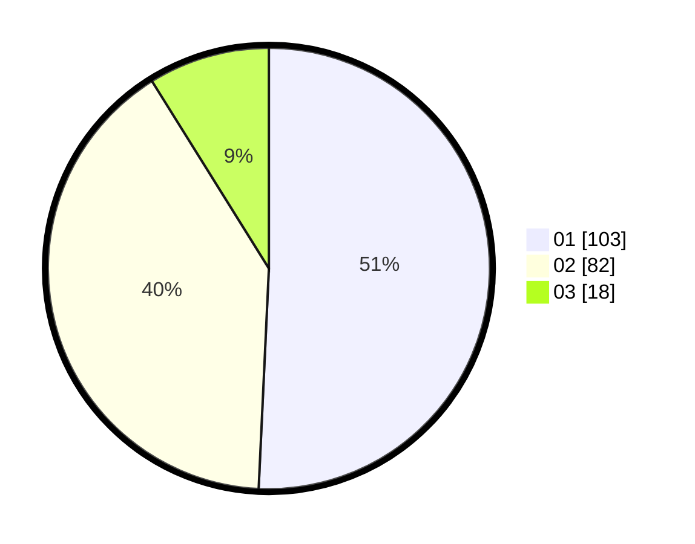

# Hasil

Hasil perolehan suara paslon dapat dilihat pada file paslon-01.txt, paslon-02.txt, dan paslon-03.txt.

Jika tidak ada, artinya data tersebut belum ada pada SIREKAP.

## Perolehan Suara

 * Paslon 01: **103**.
 * Paslon 02: **82**.
 * Paslon 03: **18**.

## Foto C Plano

https://sirekap-obj-formc.kpu.go.id/fcbf/pemilu/ppwp/31/71/01/10/03/3171011003019-20240214-194732--2dc09b5e-c9ab-4e6c-ae30-917da0e053f7.jpg

https://sirekap-obj-formc.kpu.go.id/fcbf/pemilu/ppwp/31/71/01/10/03/3171011003019-20240214-194957--873742d9-827d-4512-b960-1293fd66f111.jpg

https://sirekap-obj-formc.kpu.go.id/fcbf/pemilu/ppwp/31/71/01/10/03/3171011003019-20240214-195254--c4b108e8-3aca-4952-92d2-fdf327960757.jpg

## DATA PEMILIH TETAP

Jumlah pemilih dalam DPT: **258**.
 * L: **127**.
 * P: **131**.

## DATA PENGGUNA HAK PILIH

Jumlah pengguna hak pilih dalam DPT: **199**.
 * L: **94**.
 * P: **105**.

Jumlah pengguna hak pilih dalam DPTb: **4**.
 * L: **0**.
 * P: **4**.

Jumlah pengguna hak pilih dalam DPK: **0**.
 * L: **0**.
 * P: **0**.

Jumlah pengguna hak pilih: **203**.
 * L: **94**.
 * P: **109**.

## JUMLAH SUARA SAH DAN TIDAK SAH

JUMLAH SELURUH SUARA SAH: **203**.

JUMLAH SUARA TIDAK SAH: **0**.

JUMLAH SELURUH SUARA SAH DAN SUARA TIDAK SAH: **203**.
