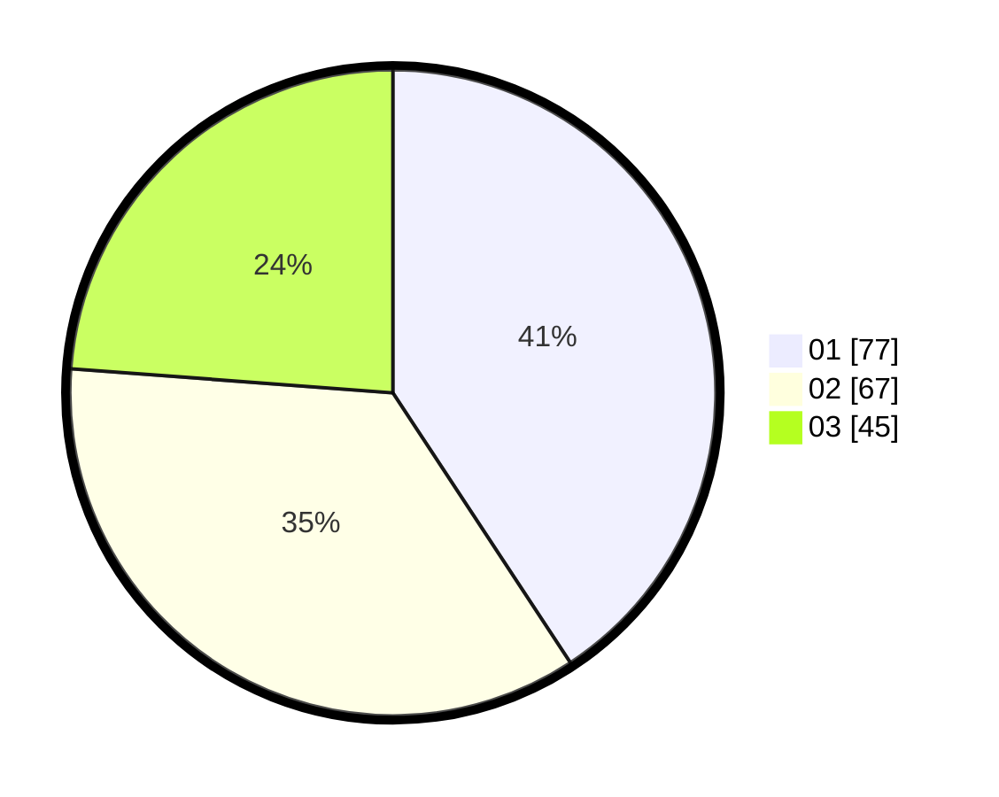

# Hasil

Hasil perolehan suara paslon dapat dilihat pada file paslon-01.txt, paslon-02.txt, dan paslon-03.txt.

Jika tidak ada, artinya data tersebut belum ada pada SIREKAP.

## Perolehan Suara

 * Paslon 01: **77**.
 * Paslon 02: **67**.
 * Paslon 03: **45**.

## Foto C Plano

https://sirekap-obj-formc.kpu.go.id/d59e/pemilu/ppwp/31/71/01/10/03/3171011003020-20240214-212354--6198fd62-1f30-4f15-bb2b-85e4d4adbae4.jpg

https://sirekap-obj-formc.kpu.go.id/d59e/pemilu/ppwp/31/71/01/10/03/3171011003020-20240214-212419--47806232-fc4a-4638-a2db-a3c4ab04ff68.jpg

https://sirekap-obj-formc.kpu.go.id/d59e/pemilu/ppwp/31/71/01/10/03/3171011003020-20240214-212434--c4784d9b-4105-4e62-a66f-7f9c8ee6e5c8.jpg

## DATA PEMILIH TETAP

Jumlah pemilih dalam DPT: **257**.
 * L: **125**.
 * P: **132**.

## DATA PENGGUNA HAK PILIH

Jumlah pengguna hak pilih dalam DPT: **190**.
 * L: **86**.
 * P: **104**.

Jumlah pengguna hak pilih dalam DPTb: **1**.
 * L: **0**.
 * P: **1**.

Jumlah pengguna hak pilih dalam DPK: **0**.
 * L: **0**.
 * P: **0**.

Jumlah pengguna hak pilih: **191**.
 * L: **86**.
 * P: **105**.

## JUMLAH SUARA SAH DAN TIDAK SAH

JUMLAH SELURUH SUARA SAH: **189**.

JUMLAH SUARA TIDAK SAH: **2**.

JUMLAH SELURUH SUARA SAH DAN SUARA TIDAK SAH: **191**.
