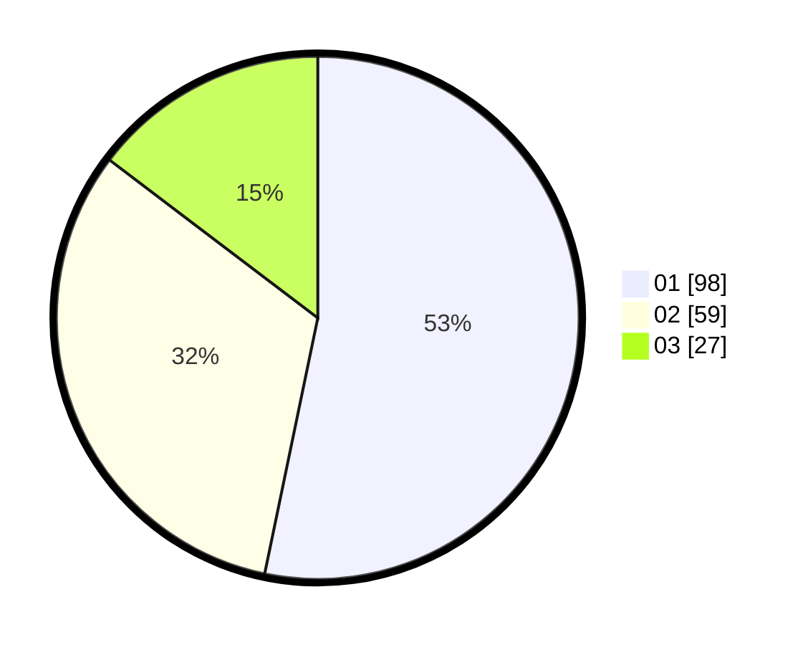

# Hasil

Hasil perolehan suara paslon dapat dilihat pada file paslon-01.txt, paslon-02.txt, dan paslon-03.txt.

Jika tidak ada, artinya data tersebut belum ada pada SIREKAP.

## Perolehan Suara

 * Paslon 01: **98**.
 * Paslon 02: **59**.
 * Paslon 03: **27**.

## Foto C Plano

https://sirekap-obj-formc.kpu.go.id/f705/pemilu/ppwp/31/71/01/10/03/3171011003023-20240215-044649--16e630dc-fd12-44fe-9bd2-715ef27e7d1f.jpg

https://sirekap-obj-formc.kpu.go.id/f705/pemilu/ppwp/31/71/01/10/03/3171011003023-20240214-220312--49ed9e04-1415-4d80-b67b-8823bedec70a.jpg

https://sirekap-obj-formc.kpu.go.id/f705/pemilu/ppwp/31/71/01/10/03/3171011003023-20240215-044821--1946f340-bac7-4a86-8236-f14078934721.jpg

## DATA PEMILIH TETAP

Jumlah pemilih dalam DPT: **246**.
 * L: **123**.
 * P: **123**.

## DATA PENGGUNA HAK PILIH

Jumlah pengguna hak pilih dalam DPT: **182**.
 * L: **88**.
 * P: **94**.

Jumlah pengguna hak pilih dalam DPTb: **3**.
 * L: **3**.
 * P: **0**.

Jumlah pengguna hak pilih dalam DPK: **0**.
 * L: **0**.
 * P: **0**.

Jumlah pengguna hak pilih: **185**.
 * L: **91**.
 * P: **94**.

## JUMLAH SUARA SAH DAN TIDAK SAH

JUMLAH SELURUH SUARA SAH: **184**.

JUMLAH SUARA TIDAK SAH: **1**.

JUMLAH SELURUH SUARA SAH DAN SUARA TIDAK SAH: **185**.
