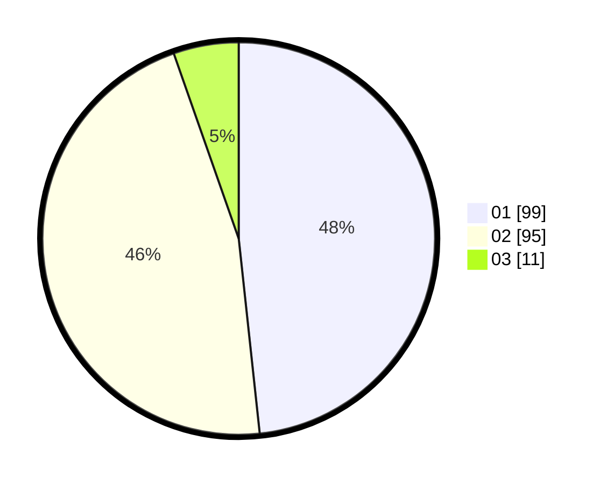

# Hasil

Hasil perolehan suara paslon dapat dilihat pada file paslon-01.txt, paslon-02.txt, dan paslon-03.txt.

Jika tidak ada, artinya data tersebut belum ada pada SIREKAP.

## Perolehan Suara

 * Paslon 01: **99**.
 * Paslon 02: **95**.
 * Paslon 03: **11**.

## Foto C Plano

https://sirekap-obj-formc.kpu.go.id/ab7d/pemilu/ppwp/31/71/01/10/03/3171011003026-20240214-210309--3e91c4be-a15b-493a-9711-eade19e95fb6.jpg

https://sirekap-obj-formc.kpu.go.id/ab7d/pemilu/ppwp/31/71/01/10/03/3171011003026-20240214-211033--62c60087-3387-426c-a881-86b6cf584944.jpg

https://sirekap-obj-formc.kpu.go.id/ab7d/pemilu/ppwp/31/71/01/10/03/3171011003026-20240214-211105--27bf4b92-2b4d-4451-9d6c-bccc91f716ed.jpg

## DATA PEMILIH TETAP

Jumlah pemilih dalam DPT: **260**.
 * L: **124**.
 * P: **136**.

## DATA PENGGUNA HAK PILIH

Jumlah pengguna hak pilih dalam DPT: **208**.
 * L: **98**.
 * P: **110**.

Jumlah pengguna hak pilih dalam DPTb: **2**.
 * L: **0**.
 * P: **2**.

Jumlah pengguna hak pilih dalam DPK: **0**.
 * L: **0**.
 * P: **0**.

Jumlah pengguna hak pilih: **210**.
 * L: **98**.
 * P: **112**.

## JUMLAH SUARA SAH DAN TIDAK SAH

JUMLAH SELURUH SUARA SAH: **210**.

JUMLAH SUARA TIDAK SAH: **5**.

JUMLAH SELURUH SUARA SAH DAN SUARA TIDAK SAH: **215**.
