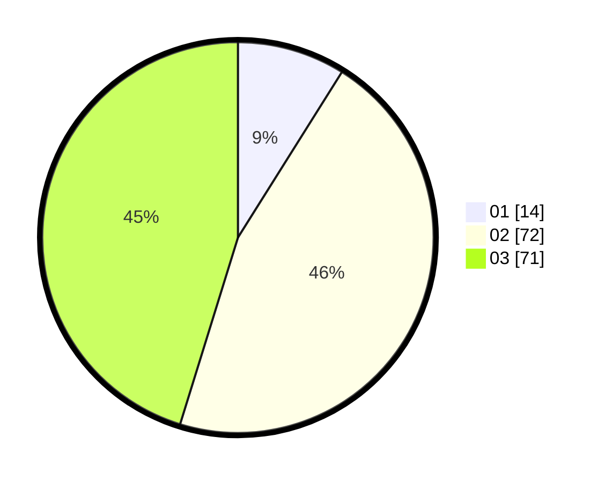

# Hasil

Hasil perolehan suara paslon dapat dilihat pada file paslon-01.txt, paslon-02.txt, dan paslon-03.txt.

Jika tidak ada, artinya data tersebut belum ada pada SIREKAP.

## Perolehan Suara

 * Paslon 01: **14**.
 * Paslon 02: **72**.
 * Paslon 03: **71**.

## Foto C Plano

https://sirekap-obj-formc.kpu.go.id/5538/pemilu/ppwp/31/71/01/10/03/3171011003029-20240215-233927--9ac8b90b-d573-460e-9964-7f072d8b8cdf.jpg

https://sirekap-obj-formc.kpu.go.id/5538/pemilu/ppwp/31/71/01/10/03/3171011003029-20240215-233928--874990bd-d00f-4479-88a4-21b8cb43c63c.jpg

https://sirekap-obj-formc.kpu.go.id/5538/pemilu/ppwp/31/71/01/10/03/3171011003029-20240215-233927--e753748c-ac03-4e8c-812e-f5d27ba2141e.jpg

## DATA PEMILIH TETAP

Jumlah pemilih dalam DPT: **224**.
 * L: **112**.
 * P: **112**.

## DATA PENGGUNA HAK PILIH

Jumlah pengguna hak pilih dalam DPT: **147**.
 * L: **71**.
 * P: **76**.

Jumlah pengguna hak pilih dalam DPTb: **10**.
 * L: **4**.
 * P: **6**.

Jumlah pengguna hak pilih dalam DPK: **2**.
 * L: **1**.
 * P: **1**.

Jumlah pengguna hak pilih: **159**.
 * L: **76**.
 * P: **83**.

## JUMLAH SUARA SAH DAN TIDAK SAH

JUMLAH SELURUH SUARA SAH: **157**.

JUMLAH SUARA TIDAK SAH: **2**.

JUMLAH SELURUH SUARA SAH DAN SUARA TIDAK SAH: **159**.
