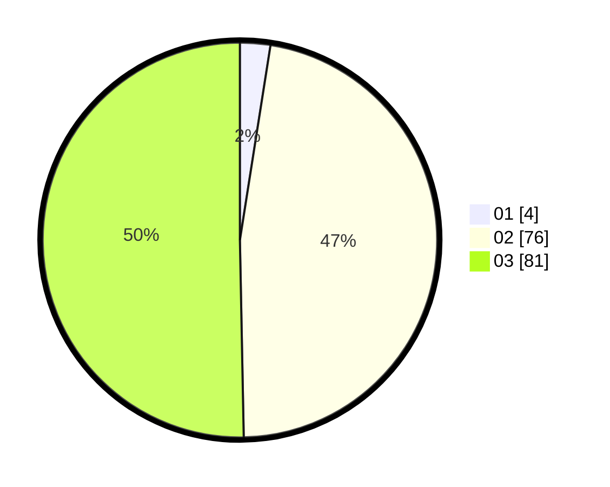

# Hasil

Hasil perolehan suara paslon dapat dilihat pada file paslon-01.txt, paslon-02.txt, dan paslon-03.txt.

Jika tidak ada, artinya data tersebut belum ada pada SIREKAP.

## Perolehan Suara

 * Paslon 01: **4**.
 * Paslon 02: **76**.
 * Paslon 03: **81**.

## Foto C Plano

https://sirekap-obj-formc.kpu.go.id/c2b5/pemilu/ppwp/31/71/01/10/03/3171011003031-20240216-222419--9394c6a8-90eb-4fd5-adf4-041940c00aa7.jpg

https://sirekap-obj-formc.kpu.go.id/c2b5/pemilu/ppwp/31/71/01/10/03/3171011003031-20240216-222420--a9363539-094c-49d6-8c84-45825594bc4d.jpg

https://sirekap-obj-formc.kpu.go.id/c2b5/pemilu/ppwp/31/71/01/10/03/3171011003031-20240216-222420--acba02b8-3afb-45f8-9613-6c72cf820155.jpg

## DATA PEMILIH TETAP

Jumlah pemilih dalam DPT: **213**.
 * L: **103**.
 * P: **110**.

## DATA PENGGUNA HAK PILIH

Jumlah pengguna hak pilih dalam DPT: **150**.
 * L: **72**.
 * P: **78**.

Jumlah pengguna hak pilih dalam DPTb: **9**.
 * L: **6**.
 * P: **3**.

Jumlah pengguna hak pilih dalam DPK: **3**.
 * L: **1**.
 * P: **2**.

Jumlah pengguna hak pilih: **162**.
 * L: **79**.
 * P: **83**.

## JUMLAH SUARA SAH DAN TIDAK SAH

JUMLAH SELURUH SUARA SAH: **161**.

JUMLAH SUARA TIDAK SAH: **1**.

JUMLAH SELURUH SUARA SAH DAN SUARA TIDAK SAH: **162**.
