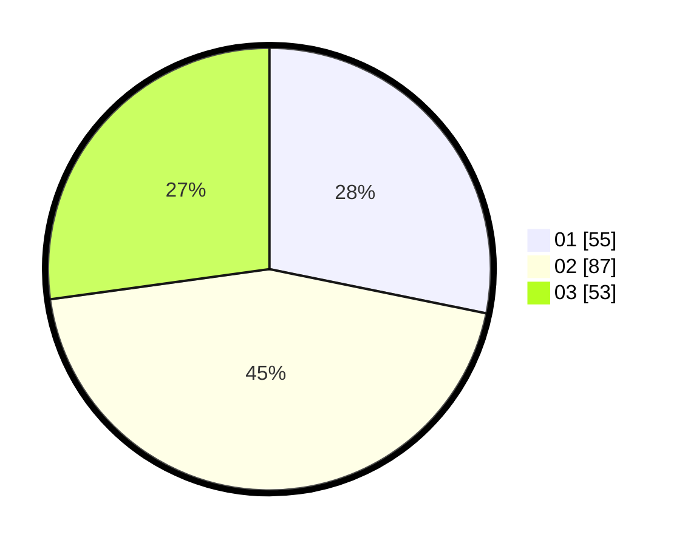

# Hasil

Hasil perolehan suara paslon dapat dilihat pada file paslon-01.txt, paslon-02.txt, dan paslon-03.txt.

Jika tidak ada, artinya data tersebut belum ada pada SIREKAP.

## Perolehan Suara

 * Paslon 01: **55**.
 * Paslon 02: **87**.
 * Paslon 03: **53**.

## Foto C Plano

https://sirekap-obj-formc.kpu.go.id/f1e0/pemilu/ppwp/31/71/01/10/03/3171011003034-20240216-031301--3f65d764-48d0-4177-98a2-8be652a38124.jpg

https://sirekap-obj-formc.kpu.go.id/f1e0/pemilu/ppwp/31/71/01/10/03/3171011003034-20240216-031302--ea33114f-30da-4556-9714-f9e9156dd340.jpg

https://sirekap-obj-formc.kpu.go.id/f1e0/pemilu/ppwp/31/71/01/10/03/3171011003034-20240216-031301--d5a7e118-c0f4-4792-aa66-fe07d208cbd0.jpg

## DATA PEMILIH TETAP

Jumlah pemilih dalam DPT: **273**.
 * L: **136**.
 * P: **137**.

## DATA PENGGUNA HAK PILIH

Jumlah pengguna hak pilih dalam DPT: **188**.
 * L: **92**.
 * P: **96**.

Jumlah pengguna hak pilih dalam DPTb: **6**.
 * L: **2**.
 * P: **4**.

Jumlah pengguna hak pilih dalam DPK: **4**.
 * L: **1**.
 * P: **3**.

Jumlah pengguna hak pilih: **198**.
 * L: **95**.
 * P: **103**.

## JUMLAH SUARA SAH DAN TIDAK SAH

JUMLAH SELURUH SUARA SAH: **195**.

JUMLAH SUARA TIDAK SAH: **3**.

JUMLAH SELURUH SUARA SAH DAN SUARA TIDAK SAH: **198**.
