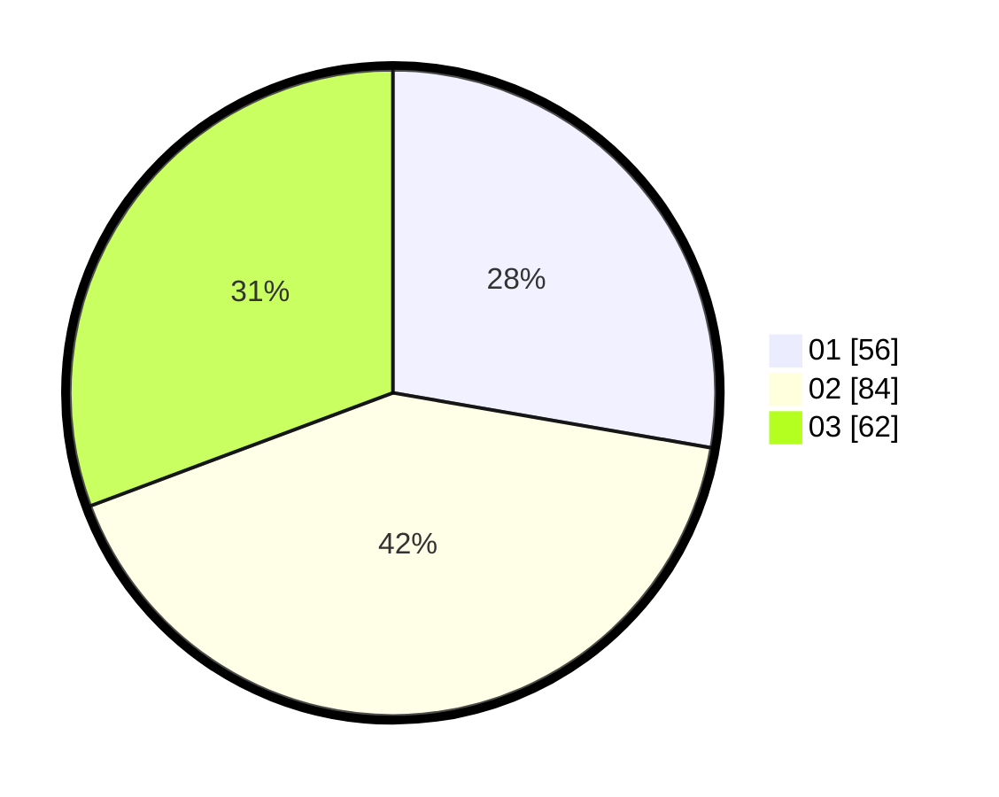

# Hasil

Hasil perolehan suara paslon dapat dilihat pada file paslon-01.txt, paslon-02.txt, dan paslon-03.txt.

Jika tidak ada, artinya data tersebut belum ada pada SIREKAP.

## Perolehan Suara

 * Paslon 01: **56**.
 * Paslon 02: **84**.
 * Paslon 03: **62**.

## Foto C Plano

https://sirekap-obj-formc.kpu.go.id/cf3f/pemilu/ppwp/31/71/01/10/03/3171011003035-20240214-200309--a6d1c941-3e1a-4678-a795-039161375279.jpg

https://sirekap-obj-formc.kpu.go.id/cf3f/pemilu/ppwp/31/71/01/10/03/3171011003035-20240214-200350--8586a75e-1055-48c3-afa3-89a5a67b4fba.jpg

https://sirekap-obj-formc.kpu.go.id/cf3f/pemilu/ppwp/31/71/01/10/03/3171011003035-20240214-200440--f1fd99f2-6359-4d5e-b0fb-af31d922e85d.jpg
