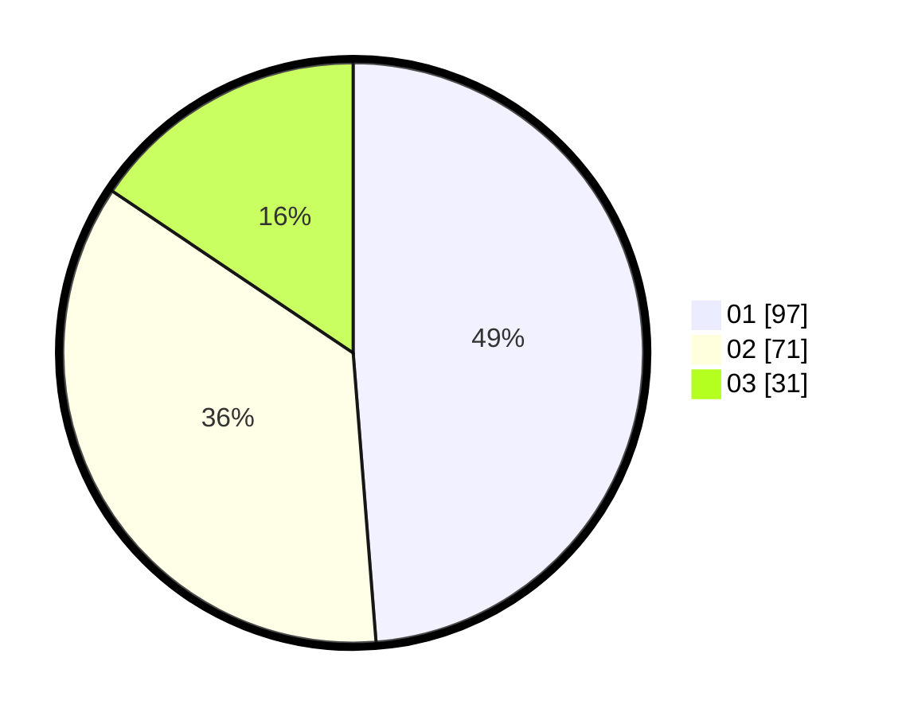

# Hasil

Hasil perolehan suara paslon dapat dilihat pada file paslon-01.txt, paslon-02.txt, dan paslon-03.txt.

Jika tidak ada, artinya data tersebut belum ada pada SIREKAP.

## Perolehan Suara

 * Paslon 01: **97**.
 * Paslon 02: **71**.
 * Paslon 03: **31**.

## Foto C Plano

https://sirekap-obj-formc.kpu.go.id/8cc2/pemilu/ppwp/31/71/01/10/03/3171011003038-20240216-081039--f4e4e1c2-1517-46b4-afa9-41f302e12b55.jpg

https://sirekap-obj-formc.kpu.go.id/8cc2/pemilu/ppwp/31/71/01/10/03/3171011003038-20240216-081044--ed082d53-83bb-4049-8222-d006c691d31a.jpg

https://sirekap-obj-formc.kpu.go.id/8cc2/pemilu/ppwp/31/71/01/10/03/3171011003038-20240216-081043--2cebaad4-ff9e-4351-9048-5a6a90cf303f.jpg

## DATA PEMILIH TETAP

Jumlah pemilih dalam DPT: **269**.
 * L: **121**.
 * P: **148**.

## DATA PENGGUNA HAK PILIH

Jumlah pengguna hak pilih dalam DPT: **195**.
 * L: **89**.
 * P: **106**.

Jumlah pengguna hak pilih dalam DPTb: **2**.
 * L: **1**.
 * P: **1**.

Jumlah pengguna hak pilih dalam DPK: **3**.
 * L: **1**.
 * P: **2**.

Jumlah pengguna hak pilih: **200**.
 * L: **91**.
 * P: **109**.

## JUMLAH SUARA SAH DAN TIDAK SAH

JUMLAH SELURUH SUARA SAH: **199**.

JUMLAH SUARA TIDAK SAH: **1**.

JUMLAH SELURUH SUARA SAH DAN SUARA TIDAK SAH: **200**.
