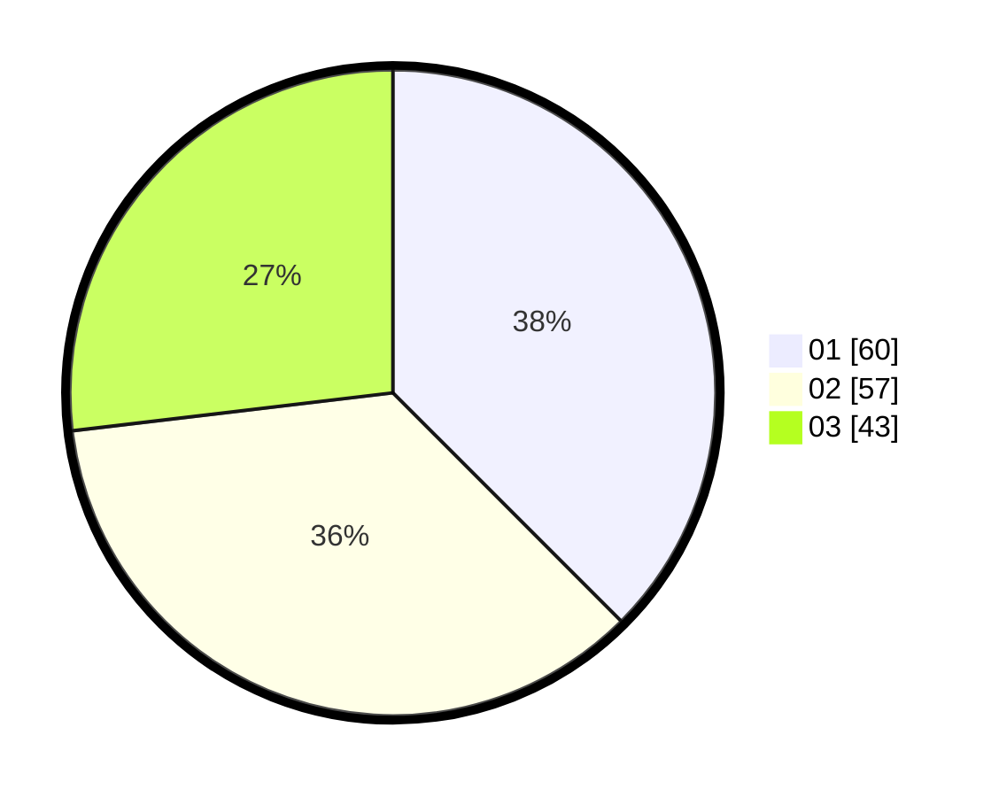

# Hasil

Hasil perolehan suara paslon dapat dilihat pada file paslon-01.txt, paslon-02.txt, dan paslon-03.txt.

Jika tidak ada, artinya data tersebut belum ada pada SIREKAP.

## Perolehan Suara

 * Paslon 01: **60**.
 * Paslon 02: **57**.
 * Paslon 03: **43**.

## Foto C Plano

https://sirekap-obj-formc.kpu.go.id/b9d8/pemilu/ppwp/31/71/01/10/03/3171011003039-20240214-225701--52fe1db2-d1db-4e15-810c-1dfdeb49ae17.jpg

https://sirekap-obj-formc.kpu.go.id/b9d8/pemilu/ppwp/31/71/01/10/03/3171011003039-20240214-225810--dfc32ba4-f915-4144-b43f-c1c90110a87c.jpg

https://sirekap-obj-formc.kpu.go.id/b9d8/pemilu/ppwp/31/71/01/10/03/3171011003039-20240214-225939--567cbed8-c5c4-4281-a4df-1d9612cf65c7.jpg

## DATA PEMILIH TETAP

Jumlah pemilih dalam DPT: **270**.
 * L: **126**.
 * P: **144**.

## DATA PENGGUNA HAK PILIH

Jumlah pengguna hak pilih dalam DPT: **161**.
 * L: **75**.
 * P: **86**.

Jumlah pengguna hak pilih dalam DPTb: **0**.
 * L: **0**.
 * P: **0**.

Jumlah pengguna hak pilih dalam DPK: **0**.
 * L: **0**.
 * P: **0**.

Jumlah pengguna hak pilih: **161**.
 * L: **75**.
 * P: **86**.

## JUMLAH SUARA SAH DAN TIDAK SAH

JUMLAH SELURUH SUARA SAH: **160**.

JUMLAH SUARA TIDAK SAH: **1**.

JUMLAH SELURUH SUARA SAH DAN SUARA TIDAK SAH: **161**.
