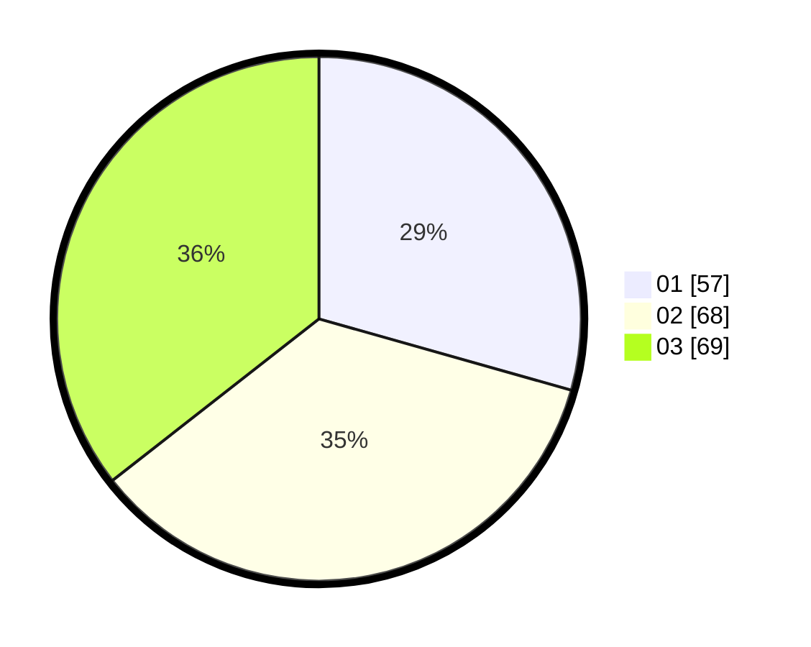

# Hasil

Hasil perolehan suara paslon dapat dilihat pada file paslon-01.txt, paslon-02.txt, dan paslon-03.txt.

Jika tidak ada, artinya data tersebut belum ada pada SIREKAP.

## Perolehan Suara

 * Paslon 01: **57**.
 * Paslon 02: **68**.
 * Paslon 03: **69**.

## Foto C Plano

https://sirekap-obj-formc.kpu.go.id/ad44/pemilu/ppwp/31/71/01/10/03/3171011003044-20240216-003321--a205906e-6725-4e86-acc6-e8ca2ace5660.jpg

https://sirekap-obj-formc.kpu.go.id/ad44/pemilu/ppwp/31/71/01/10/03/3171011003044-20240216-003330--b77ca852-03f9-44bf-85d7-f91e4a571db5.jpg

https://sirekap-obj-formc.kpu.go.id/ad44/pemilu/ppwp/31/71/01/10/03/3171011003044-20240216-003323--e3ff75f4-5c04-4dfa-a42e-14cb2cfbbfe3.jpg

## DATA PEMILIH TETAP

Jumlah pemilih dalam DPT: **249**.
 * L: **112**.
 * P: **137**.

## DATA PENGGUNA HAK PILIH

Jumlah pengguna hak pilih dalam DPT: **178**.
 * L: **88**.
 * P: **90**.

Jumlah pengguna hak pilih dalam DPTb: **6**.
 * L: **4**.
 * P: **2**.

Jumlah pengguna hak pilih dalam DPK: **10**.
 * L: **6**.
 * P: **4**.

Jumlah pengguna hak pilih: **194**.
 * L: **98**.
 * P: **96**.

## JUMLAH SUARA SAH DAN TIDAK SAH

JUMLAH SELURUH SUARA SAH: **194**.

JUMLAH SUARA TIDAK SAH: **1**.

JUMLAH SELURUH SUARA SAH DAN SUARA TIDAK SAH: **195**.
