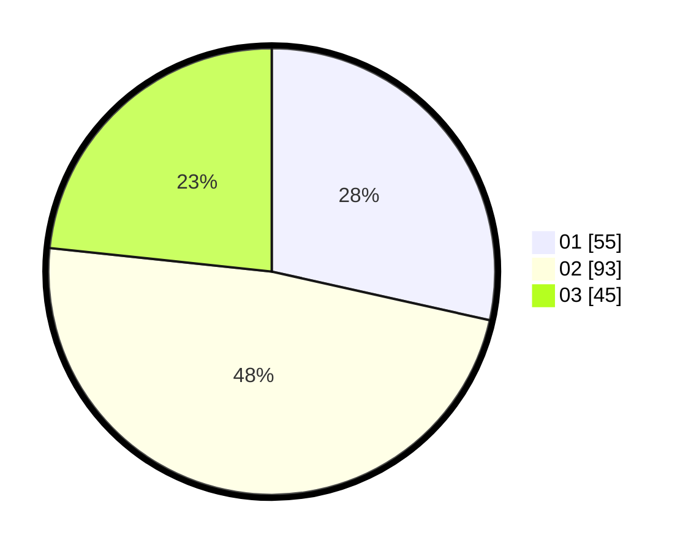

# Hasil

Hasil perolehan suara paslon dapat dilihat pada file paslon-01.txt, paslon-02.txt, dan paslon-03.txt.

Jika tidak ada, artinya data tersebut belum ada pada SIREKAP.

## Perolehan Suara

 * Paslon 01: **55**.
 * Paslon 02: **93**.
 * Paslon 03: **45**.

## Foto C Plano

https://sirekap-obj-formc.kpu.go.id/ee73/pemilu/ppwp/31/71/01/10/03/3171011003046-20240214-234325--3b6c4c56-babc-4735-8596-d1b9a9915974.jpg

https://sirekap-obj-formc.kpu.go.id/ee73/pemilu/ppwp/31/71/01/10/03/3171011003046-20240214-234536--9ec5fe80-fc20-4d84-bd6a-4c3aa775ae10.jpg

https://sirekap-obj-formc.kpu.go.id/ee73/pemilu/ppwp/31/71/01/10/03/3171011003046-20240215-000048--1f6c608e-b29c-47ba-9b07-7846b225e3a8.jpg

## DATA PEMILIH TETAP

Jumlah pemilih dalam DPT: **224**.
 * L: **122**.
 * P: **102**.

## DATA PENGGUNA HAK PILIH

Jumlah pengguna hak pilih dalam DPT: **182**.
 * L: **89**.
 * P: **93**.

Jumlah pengguna hak pilih dalam DPTb: **10**.
 * L: **4**.
 * P: **6**.

Jumlah pengguna hak pilih dalam DPK: **5**.
 * L: **2**.
 * P: **3**.

Jumlah pengguna hak pilih: **197**.
 * L: **95**.
 * P: **102**.

## JUMLAH SUARA SAH DAN TIDAK SAH

JUMLAH SELURUH SUARA SAH: **193**.

JUMLAH SUARA TIDAK SAH: **0**.

JUMLAH SELURUH SUARA SAH DAN SUARA TIDAK SAH: **0**.
