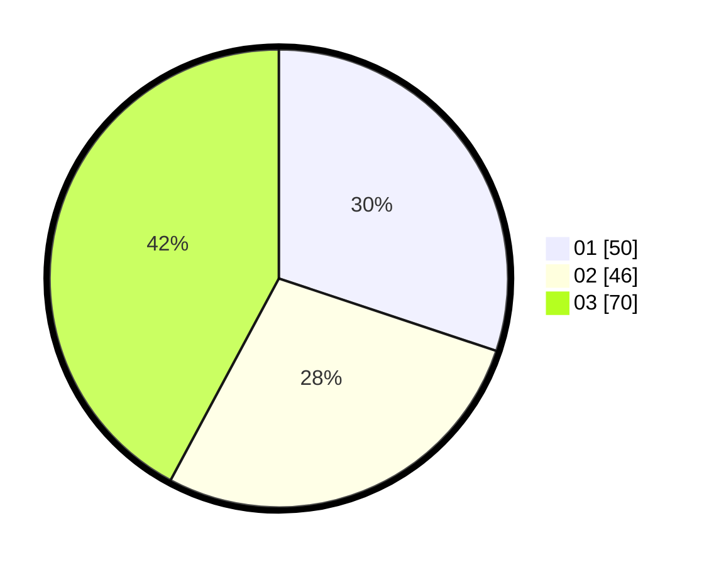

# Hasil

Hasil perolehan suara paslon dapat dilihat pada file paslon-01.txt, paslon-02.txt, dan paslon-03.txt.

Jika tidak ada, artinya data tersebut belum ada pada SIREKAP.

## Perolehan Suara

 * Paslon 01: **50**.
 * Paslon 02: **46**.
 * Paslon 03: **70**.

## Foto C Plano

https://sirekap-obj-formc.kpu.go.id/e6d6/pemilu/ppwp/31/71/01/10/03/3171011003049-20240214-200140--c2caec46-aa9d-4828-b51f-27b026056db4.jpg

https://sirekap-obj-formc.kpu.go.id/e6d6/pemilu/ppwp/31/71/01/10/03/3171011003049-20240214-200243--144d12bf-02ef-42b9-9955-cbbe6a634d6f.jpg

https://sirekap-obj-formc.kpu.go.id/e6d6/pemilu/ppwp/31/71/01/10/03/3171011003049-20240214-200403--7306b2b7-8bf1-4142-aadb-74fdecaecabe.jpg

## DATA PEMILIH TETAP

Jumlah pemilih dalam DPT: **219**.
 * L: **108**.
 * P: **111**.

## DATA PENGGUNA HAK PILIH

Jumlah pengguna hak pilih dalam DPT: **161**.
 * L: **70**.
 * P: **91**.

Jumlah pengguna hak pilih dalam DPTb: **7**.
 * L: **3**.
 * P: **4**.

Jumlah pengguna hak pilih dalam DPK: **1**.
 * L: **1**.
 * P: **0**.

Jumlah pengguna hak pilih: **169**.
 * L: **74**.
 * P: **95**.

## JUMLAH SUARA SAH DAN TIDAK SAH

JUMLAH SELURUH SUARA SAH: **166**.

JUMLAH SUARA TIDAK SAH: **3**.

JUMLAH SELURUH SUARA SAH DAN SUARA TIDAK SAH: **169**.
