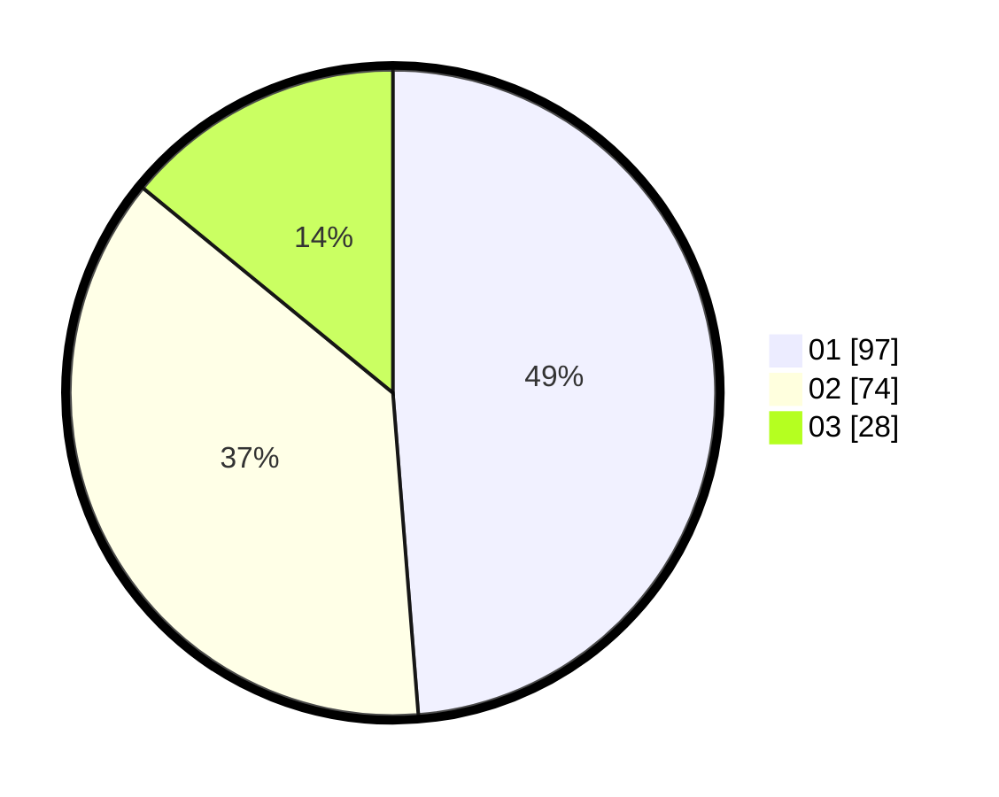

# Hasil

Hasil perolehan suara paslon dapat dilihat pada file paslon-01.txt, paslon-02.txt, dan paslon-03.txt.

Jika tidak ada, artinya data tersebut belum ada pada SIREKAP.

## Perolehan Suara

 * Paslon 01: **97**.
 * Paslon 02: **74**.
 * Paslon 03: **28**.

## Foto C Plano

https://sirekap-obj-formc.kpu.go.id/d33d/pemilu/ppwp/31/71/01/10/03/3171011003051-20240215-181513--7046ab6e-11da-431c-ab13-47a82e09ea4b.jpg

https://sirekap-obj-formc.kpu.go.id/d33d/pemilu/ppwp/31/71/01/10/03/3171011003051-20240215-201106--604b0f07-f508-46c1-a5ad-844c48d7c524.jpg
