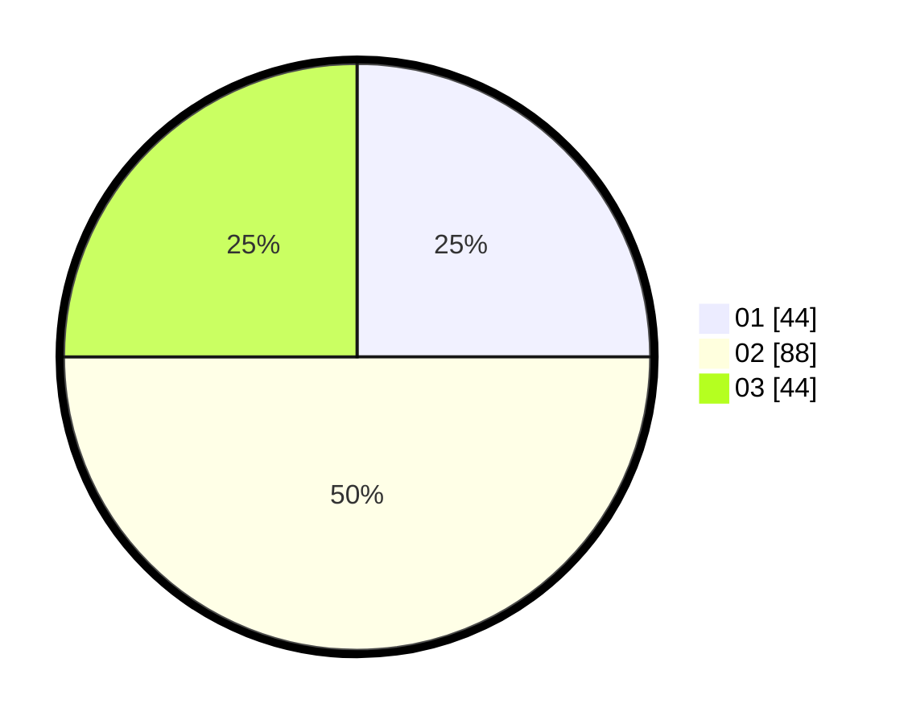

# Hasil

Hasil perolehan suara paslon dapat dilihat pada file paslon-01.txt, paslon-02.txt, dan paslon-03.txt.

Jika tidak ada, artinya data tersebut belum ada pada SIREKAP.

## Perolehan Suara

 * Paslon 01: **44**.
 * Paslon 02: **88**.
 * Paslon 03: **44**.

## Foto C Plano

https://sirekap-obj-formc.kpu.go.id/057f/pemilu/ppwp/31/71/01/10/03/3171011003054-20240214-201248--f69ad0b1-5a99-43fa-9fdb-bf2d53431d53.jpg

https://sirekap-obj-formc.kpu.go.id/057f/pemilu/ppwp/31/71/01/10/03/3171011003054-20240214-201316--d819e357-3d65-44bd-91c6-21599f289881.jpg

https://sirekap-obj-formc.kpu.go.id/057f/pemilu/ppwp/31/71/01/10/03/3171011003054-20240214-205003--c629ba05-e39a-4a5a-8ec4-4afbbcbd47bb.jpg

## DATA PEMILIH TETAP

Jumlah pemilih dalam DPT: **251**.
 * L: **120**.
 * P: **131**.

## DATA PENGGUNA HAK PILIH

Jumlah pengguna hak pilih dalam DPT: **169**.
 * L: **80**.
 * P: **89**.

Jumlah pengguna hak pilih dalam DPTb: **6**.
 * L: **2**.
 * P: **4**.

Jumlah pengguna hak pilih dalam DPK: **1**.
 * L: **1**.
 * P: **0**.

Jumlah pengguna hak pilih: **176**.
 * L: **83**.
 * P: **93**.

## JUMLAH SUARA SAH DAN TIDAK SAH

JUMLAH SELURUH SUARA SAH: **176**.

JUMLAH SUARA TIDAK SAH: **5**.

JUMLAH SELURUH SUARA SAH DAN SUARA TIDAK SAH: **181**.
