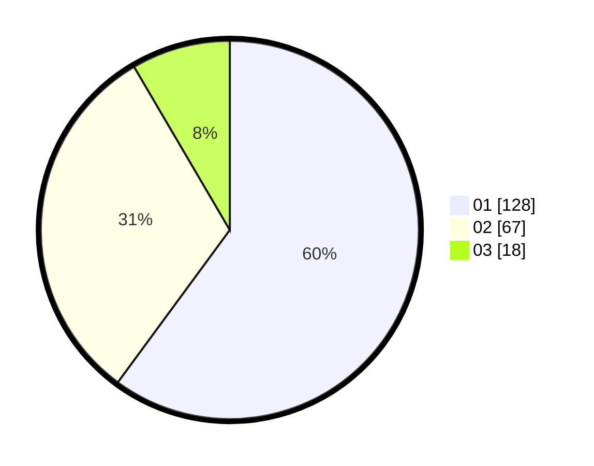

# Hasil

Hasil perolehan suara paslon dapat dilihat pada file paslon-01.txt, paslon-02.txt, dan paslon-03.txt.

Jika tidak ada, artinya data tersebut belum ada pada SIREKAP.

## Perolehan Suara

 * Paslon 01: **128**.
 * Paslon 02: **67**.
 * Paslon 03: **18**.

## Foto C Plano

https://sirekap-obj-formc.kpu.go.id/0822/pemilu/ppwp/31/71/01/10/03/3171011003056-20240215-002222--c4d18b73-85fb-4be0-84da-a0f9fd7b5d6f.jpg

https://sirekap-obj-formc.kpu.go.id/0822/pemilu/ppwp/31/71/01/10/03/3171011003056-20240215-002311--0458d469-502f-4f99-af14-02e9208d9581.jpg

https://sirekap-obj-formc.kpu.go.id/0822/pemilu/ppwp/31/71/01/10/03/3171011003056-20240215-002412--ecff3dda-5ca2-420d-a5c3-fd26a8021905.jpg

## DATA PEMILIH TETAP

Jumlah pemilih dalam DPT: **213**.
 * L: **106**.
 * P: **107**.

## DATA PENGGUNA HAK PILIH

Jumlah pengguna hak pilih dalam DPT: **213**.
 * L: **106**.
 * P: **107**.

Jumlah pengguna hak pilih dalam DPTb: **3**.
 * L: **1**.
 * P: **2**.

Jumlah pengguna hak pilih dalam DPK: **0**.
 * L: **0**.
 * P: **0**.

Jumlah pengguna hak pilih: **216**.
 * L: **107**.
 * P: **109**.

## JUMLAH SUARA SAH DAN TIDAK SAH

JUMLAH SELURUH SUARA SAH: **213**.

JUMLAH SUARA TIDAK SAH: **3**.

JUMLAH SELURUH SUARA SAH DAN SUARA TIDAK SAH: **216**.
