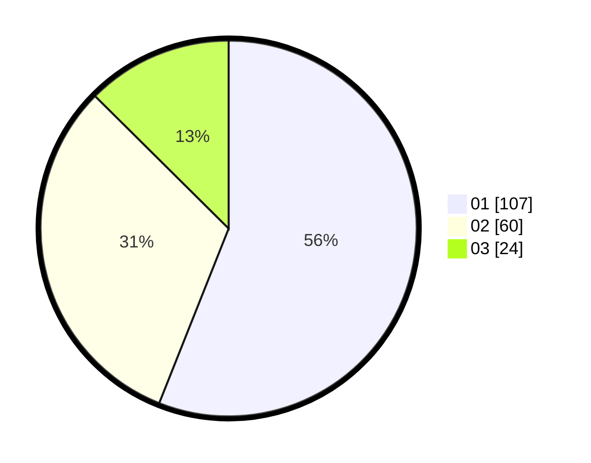

# Hasil

Hasil perolehan suara paslon dapat dilihat pada file paslon-01.txt, paslon-02.txt, dan paslon-03.txt.

Jika tidak ada, artinya data tersebut belum ada pada SIREKAP.

## Perolehan Suara

 * Paslon 01: **107**.
 * Paslon 02: **60**.
 * Paslon 03: **24**.

## Foto C Plano

https://sirekap-obj-formc.kpu.go.id/4957/pemilu/ppwp/31/71/01/10/03/3171011003057-20240214-223432--aecd5d41-7e97-4eb1-9bdd-abc95fc457b7.jpg

https://sirekap-obj-formc.kpu.go.id/4957/pemilu/ppwp/31/71/01/10/03/3171011003057-20240214-223522--866d0d0f-50cc-4a49-a162-d0e1b5ff165e.jpg

https://sirekap-obj-formc.kpu.go.id/4957/pemilu/ppwp/31/71/01/10/03/3171011003057-20240214-223736--4cf46783-dbfb-4dc9-9146-326ec6010447.jpg

## DATA PEMILIH TETAP

Jumlah pemilih dalam DPT: **257**.
 * L: **119**.
 * P: **138**.

## DATA PENGGUNA HAK PILIH

Jumlah pengguna hak pilih dalam DPT: **188**.
 * L: **89**.
 * P: **99**.

Jumlah pengguna hak pilih dalam DPTb: **6**.
 * L: **2**.
 * P: **4**.

Jumlah pengguna hak pilih dalam DPK: **1**.
 * L: **0**.
 * P: **1**.

Jumlah pengguna hak pilih: **195**.
 * L: **91**.
 * P: **104**.

## JUMLAH SUARA SAH DAN TIDAK SAH

JUMLAH SELURUH SUARA SAH: **191**.

JUMLAH SUARA TIDAK SAH: **4**.

JUMLAH SELURUH SUARA SAH DAN SUARA TIDAK SAH: **195**.
