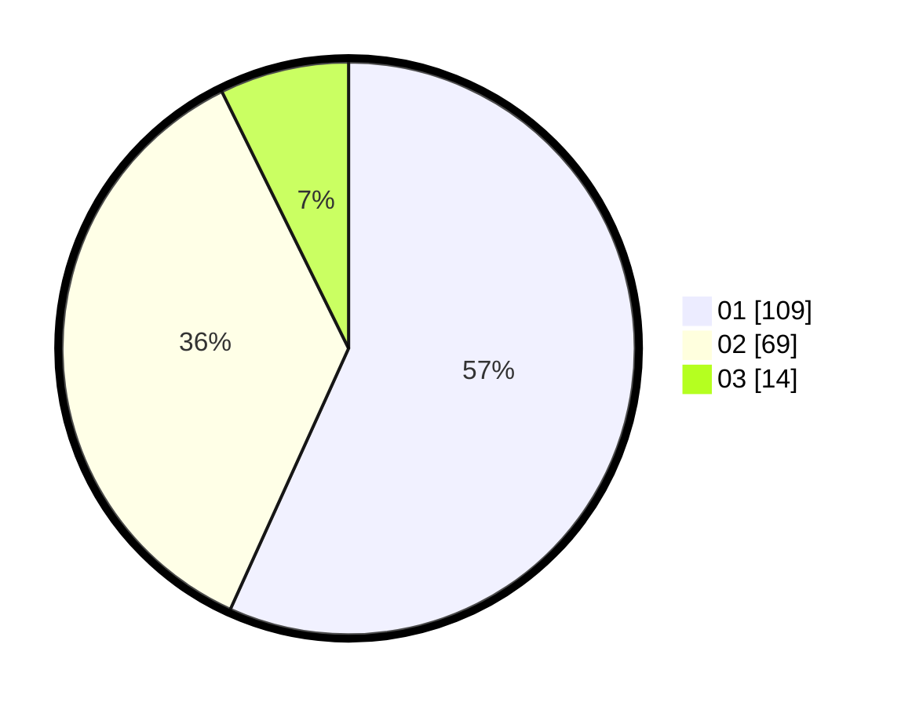

# Hasil

Hasil perolehan suara paslon dapat dilihat pada file paslon-01.txt, paslon-02.txt, dan paslon-03.txt.

Jika tidak ada, artinya data tersebut belum ada pada SIREKAP.

## Perolehan Suara

 * Paslon 01: **109**.
 * Paslon 02: **69**.
 * Paslon 03: **14**.

## Foto C Plano

https://sirekap-obj-formc.kpu.go.id/c22a/pemilu/ppwp/31/71/01/10/03/3171011003060-20240214-204349--77a7c9eb-989c-474b-8183-074c5cfccf1d.jpg

https://sirekap-obj-formc.kpu.go.id/c22a/pemilu/ppwp/31/71/01/10/03/3171011003060-20240214-204354--3c66857e-aa68-4d2f-a0b4-5d26d95e0954.jpg

https://sirekap-obj-formc.kpu.go.id/c22a/pemilu/ppwp/31/71/01/10/03/3171011003060-20240214-204357--fa0e4e02-7b58-46da-806b-01dfa43c9148.jpg

## DATA PEMILIH TETAP

Jumlah pemilih dalam DPT: **264**.
 * L: **141**.
 * P: **123**.

## DATA PENGGUNA HAK PILIH

Jumlah pengguna hak pilih dalam DPT: **188**.
 * L: **98**.
 * P: **90**.

Jumlah pengguna hak pilih dalam DPTb: **6**.
 * L: **3**.
 * P: **3**.

Jumlah pengguna hak pilih dalam DPK: **0**.
 * L: **0**.
 * P: **0**.

Jumlah pengguna hak pilih: **194**.
 * L: **101**.
 * P: **93**.

## JUMLAH SUARA SAH DAN TIDAK SAH

JUMLAH SELURUH SUARA SAH: **192**.

JUMLAH SUARA TIDAK SAH: **2**.

JUMLAH SELURUH SUARA SAH DAN SUARA TIDAK SAH: **194**.
