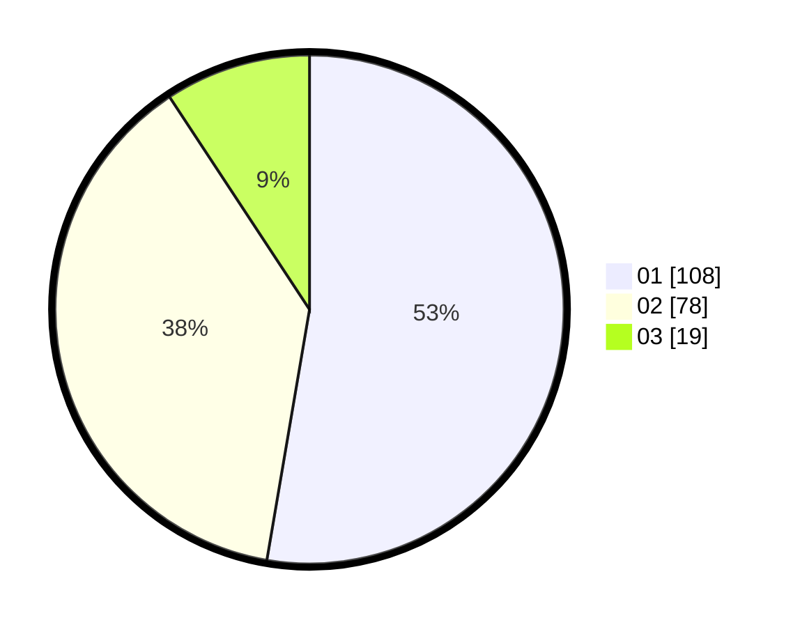

# Hasil

Hasil perolehan suara paslon dapat dilihat pada file paslon-01.txt, paslon-02.txt, dan paslon-03.txt.

Jika tidak ada, artinya data tersebut belum ada pada SIREKAP.

## Perolehan Suara

 * Paslon 01: **108**.
 * Paslon 02: **78**.
 * Paslon 03: **19**.

## Foto C Plano

https://sirekap-obj-formc.kpu.go.id/b538/pemilu/ppwp/31/71/01/10/03/3171011003061-20240214-193035--8806e85d-055c-4858-87f0-c23bead9d795.jpg

https://sirekap-obj-formc.kpu.go.id/b538/pemilu/ppwp/31/71/01/10/03/3171011003061-20240214-191300--706f425a-2851-4311-8d16-43a568989c1d.jpg

https://sirekap-obj-formc.kpu.go.id/b538/pemilu/ppwp/31/71/01/10/03/3171011003061-20240214-193319--6d74cad9-0400-45cd-816c-1ee3f2c56a55.jpg

## DATA PEMILIH TETAP

Jumlah pemilih dalam DPT: **265**.
 * L: **135**.
 * P: **130**.

## DATA PENGGUNA HAK PILIH

Jumlah pengguna hak pilih dalam DPT: **194**.
 * L: **94**.
 * P: **100**.

Jumlah pengguna hak pilih dalam DPTb: **11**.
 * L: **4**.
 * P: **7**.

Jumlah pengguna hak pilih dalam DPK: **0**.
 * L: **0**.
 * P: **0**.

Jumlah pengguna hak pilih: **205**.
 * L: **98**.
 * P: **107**.

## JUMLAH SUARA SAH DAN TIDAK SAH

JUMLAH SELURUH SUARA SAH: **205**.

JUMLAH SUARA TIDAK SAH: **0**.

JUMLAH SELURUH SUARA SAH DAN SUARA TIDAK SAH: **205**.
