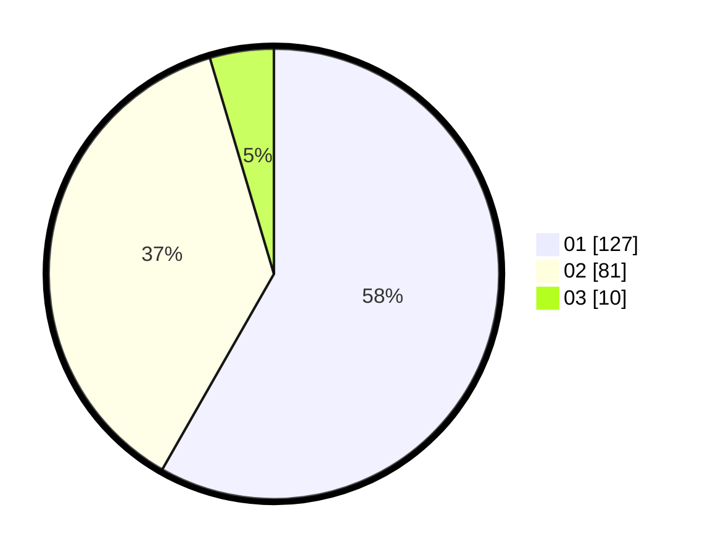

# Hasil

Hasil perolehan suara paslon dapat dilihat pada file paslon-01.txt, paslon-02.txt, dan paslon-03.txt.

Jika tidak ada, artinya data tersebut belum ada pada SIREKAP.

## Perolehan Suara

 * Paslon 01: **127**.
 * Paslon 02: **81**.
 * Paslon 03: **10**.

## Foto C Plano

https://sirekap-obj-formc.kpu.go.id/66c6/pemilu/ppwp/31/71/01/10/03/3171011003062-20240214-223710--a107f177-d3f6-4628-9db8-fc7c479369f1.jpg

https://sirekap-obj-formc.kpu.go.id/66c6/pemilu/ppwp/31/71/01/10/03/3171011003062-20240214-224040--4fb4412c-c2fe-4e2e-9f6a-586678bdbbcd.jpg

https://sirekap-obj-formc.kpu.go.id/66c6/pemilu/ppwp/31/71/01/10/03/3171011003062-20240214-224209--ee589bec-6a5e-4386-885b-f1d55c76ec32.jpg

## DATA PEMILIH TETAP

Jumlah pemilih dalam DPT: **265**.
 * L: **134**.
 * P: **131**.

## DATA PENGGUNA HAK PILIH

Jumlah pengguna hak pilih dalam DPT: **211**.
 * L: **108**.
 * P: **103**.

Jumlah pengguna hak pilih dalam DPTb: **6**.
 * L: **2**.
 * P: **4**.

Jumlah pengguna hak pilih dalam DPK: **2**.
 * L: **2**.
 * P: **0**.

Jumlah pengguna hak pilih: **219**.
 * L: **112**.
 * P: **107**.

## JUMLAH SUARA SAH DAN TIDAK SAH

JUMLAH SELURUH SUARA SAH: **218**.

JUMLAH SUARA TIDAK SAH: **1**.

JUMLAH SELURUH SUARA SAH DAN SUARA TIDAK SAH: **219**.
